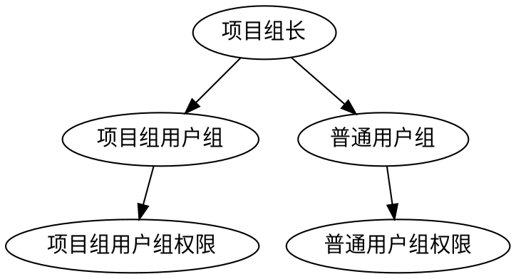
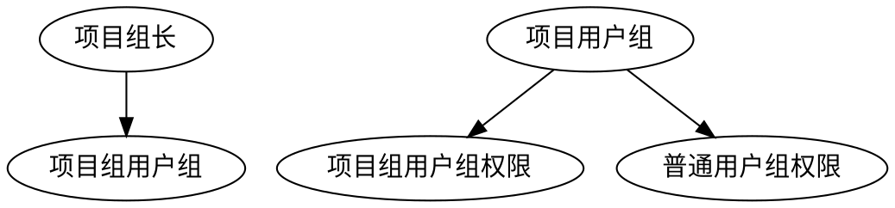

# RBAC 权限设计

RBAC（Role-based Access Control）是基于角色的访问控制的简称，是一种权限设置模式。

## RBAC 组成

RBAC 将系统权限由三部分组成
 * 用户组: 是一组用户的统称，属于该用户组的用户应该具有相同的权限，可以有多个
 * 权限: 是对用户有权使用某一个接口或访问某个资源的判断，可以有多个
 * 用户: 某个账号，可以有多个

 每一个用户组对应一组权限，而每一个用户又属于一个用户组，那么就将用户与权限关联起来了。

 ## 考虑点

 * 用户与用户组是一对一还是一对多的关系，项目组长既是项目组长用户，也是普通用户，有下面两种设计方式：

一对多，项目组长对应项目用户组和普通用户组两个用户组，拥有两个用户组权限.

一对一, 项目组长对应项目用户组，项目用户组权限包含项目用户组权限和普通用户组权限

一对多设计时粒度更细，权限有修改时只需要修改对应的用户组权限即可，但是可能存在着用户组遗漏，维护时要习性；一对一设计时使用更方便，更直观，但是权限有修改时可能需修改多个用户组对应的权限，选择一对一还是选择一堆多。

 * 权限粒度

权限其实是一个一个的用户行为，对于后端来说，权限就是是够被允许调用某个接口，而对于前端来说，是用户是否被允许看到某个页面。在权限的设计粒度上也有两种选择，一种是将权限按权限树等级设计，具有该接口的父权限时则不需要再查看是否具有该接口的权限；一种是按最小粒度权限设计，所的接口对应一个权限，权限调用时，必须具有该权限才允许通行。

|权限树设计|最小粒度权限设计|
|-----|------|
|设计较为复杂、维护工作量相当，但是项目结构清晰|设计简单，工作量较大、后期可能需要维护的权限数量可能很庞大|

