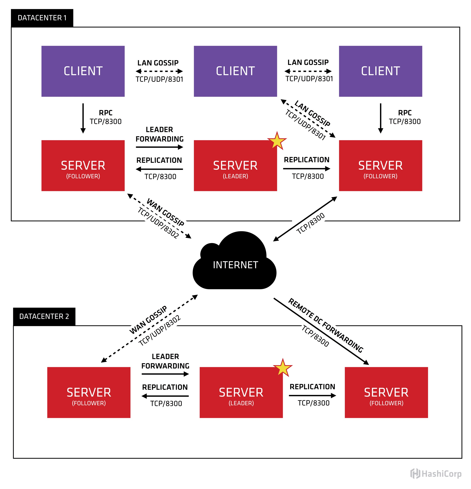
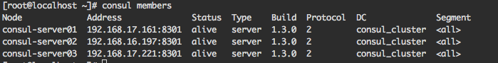

# consul 简介
---
consul 是一个服务管理工具，提供服务发现、配置和 segmentation functionality 功能化管理平台，这些功能既可以单独使用，也可以一起使用，consul 需要数据平面支持代理和本机集成模型，consul 还福袋一个简单的内置代理工具，也支持第三方代理，consul 同时也是也分布式、高可用的系统。

consul 主要特征如下：
 - 服务发现: consul client 能够向 service 通过 mysql 或 api 注册服务，其他 client 通过 DNS 或 HTTP 来获取服务信息。
 - 健康检查: consul client 能够提供提供任意数量的健康检查，这些健康检查可以与给定的服务关联，也可以与本地节点相关联。
 - 键值存储: 应用程序可以 将 consul 的分层键/值存储用于任何用途，包括动态配置等，值可以是任何类型的数据，包括 json 等，与 consul-template 搭配起来使用更加好。
 - 保证服务通信安全: consul 可以为服务生成和分发 TLS 证书，以建立相互的 TLS 连接。
 - 多数据中心: consul 支持多数据中心

## consul 术语

 - agent: 一个 agent 是 consul 集群中每个成员上长时间运行的守护程序，通过`consul agent`来启动一个 agent，agent 能够以 client 或 server 模型运行，由于所有的节点都必须运行 agent，因此将 节点成为 client 或 server 更易于理解，所有的 agent 都可以运行 DNS 或 HTTP 接口，并负责运行检查并保持服务同步。
 - client: client 将所有的 RPC 转发到 server，client 是无状态的
 - server: server 是一个具有扩展能力的 agent，server 需要参与 raft 仲裁、维护集群状态、相应 RPC 查询、与其他数据中心交换 WAN gossip、将查询转发给 leader 或远程数据中心，本身也会持久化信息。
 - datacenter: 数据中心，一个集群只有一个数据中心
 - gossip: consul 建立在 serf 的基础之上，它提供了一个用户多播目的的完成的 gossip 协议，serf 提供成员关系，故障检测和事件广播
 - LAN Gossip: 包含所有位于同一个局域网网或者数据中心的所有节点
 - WAN Gossip: 只包含 server， 这些 server 主要分布在不同的数据中心并且通常通过英特网或者广域网通信

consul架构说明：


## 基本使用

安装 consul 后，必须运行一个 agent，agent 能够以 client 或 server 方式运行，每个数据中心至少要有一个 server，建议使用 3-5 个 master，如果 server 出现故障，数据可能丢失，因此不建议单个 server 部署。
其他的 agent 都以 client 的方式运行，client 方式运行是一个非常轻量级的进程，它注册服务、进行健康检查，并将查询服务转发给 server，每个节点都必须运行一个 agent。

## consul 集群配置
启动 server 节点
```sh
docker run -e 'CONSUL_LOCAL_CONFIG={"skip_leave_on_interrupt": true}' \
    --net=host \
    --name=node1 \
    -d consul agent -server \
    -disable-host-node-id \
    -bind=172.17.0.1 \
    -bootstrap-expect=3 \
    -client=0.0.0.0 -ui

docker run -e 'CONSUL_LOCAL_CONFIG={"skip_leave_on_interrupt": true}' \
    --net=host \
    --name=node2 \
    -d consul agent -server \
    -disable-host-node-id \
    -bind=172.17.0.2 \
    -bootstrap-expect=3 \
    -client=0.0.0.0 -ui

docker run -e 'CONSUL_LOCAL_CONFIG={"skip_leave_on_interrupt": true}' \
    --net=host \
    --name=node1 \
    -d consul agent -server \
    -disable-host-node-id \
    -bind=172.17.0.3 \
    -bootstrap-expect=3 \
    -client=0.0.0.0 -ui
```
在用 docker 启动 consul 的时候必须要携带`bind`参数，`bind`的地址被用于集群内部通信，地址必须是可到达的一个地址，且只能被一个 consul server 绑定。

加入集群
第一种方法：进去第二个和第三个 consul 镜像，运行下面命令
```sh
consul agent -retry-join node1IP
consul agent -retry-join node1IP
```

启动 client
```sh
docker run -e 'CONSUL_LOCAL_CONFIG={"skip_leave_on_interrupt": true}' \
    --net=host \
    --name=node_client1 \
    -d consul agent \
    -disable-host-node-id \
    -client=0.0.0.0 \
    -bind=127.0.0.1 \
    -retry-join=172.17.0.1
```

## 集群搭建--物理机

机器地址:
 - 192.168.17.161(s)
 - 192.168.16.197(s)
 - 192.168.17.221(s)
 - 192.168.16.127(c)

1.在三台 server 机器上创建以下目录
```sh
mkdir -p /opt/consul/conf
mkdir -p /opt/consul/data
mkdir -p /opt/consul/log
```

2.在三台 serevr 机器上`/opt/consul/conf`目录下执行下面命令
192.168.17.161 机器
```sh
cat > server.json << EOF
{
  "datacenter": "consul_cluster",
  "bind_addr": "192.168.17.161",
  "data_dir": "/opt/consul/data",
  "log_level": "INFO",
  "node_name": "consul-server01",
  "server": true,
  "bootstrap_expect": 3,
  "client_addr": "0.0.0.0",
  "enable_syslog": true,
  "rejoin_after_leave": true,
  "ui": true,
  "log_file": "/opt/consul/log",
  "retry_join": ["192.168.17.161","192.168.16.197","192.168.17.221"]
}
EOF
```
192.168.16.197 机器
```sh
cat > server.json << EOF
{
  "datacenter": "consul_cluster",
  "bind_addr": "192.168.16.197",
  "data_dir": "/opt/consul/data",
  "log_level": "INFO",
  "node_name": "consul-server02",
  "server": true,
  "bootstrap_expect": 3,
  "client_addr": "0.0.0.0",
  "enable_syslog": true,
  "rejoin_after_leave": true,
  "ui": true,
  "log_file": "/opt/consul/log",
  "retry_join": ["192.168.17.161","192.168.16.197","192.168.17.221"]
}
EOF
```
192.168.17.221 机器
```sh
cat > server.json << EOF
{
  "datacenter": "consul_cluster",
  "bind_addr": "192.168.17.221",
  "data_dir": "/opt/consul/data",
  "log_level": "INFO",
  "node_name": "consul-server03",
  "server": true,
  "bootstrap_expect": 3,
  "client_addr": "0.0.0.0",
  "enable_syslog": true,
  "rejoin_after_leave": true,
  "ui": true,
  "log_file": "/opt/consul/log",
  "retry_join": ["192.168.17.161","192.168.16.197","192.168.17.221"]
}
EOF
```
配置文件参数说明如下：

查看集群结果：

