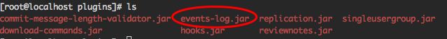
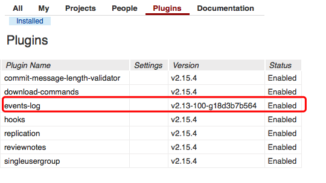
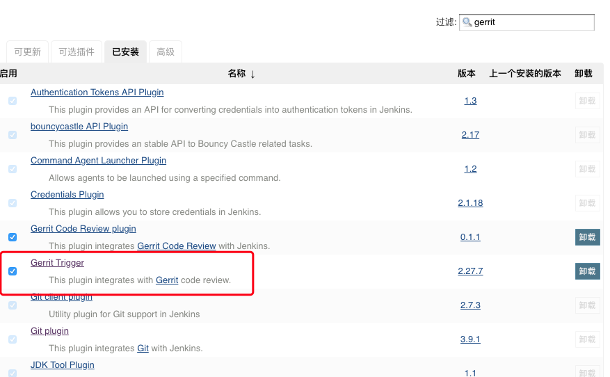
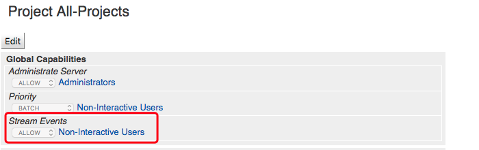
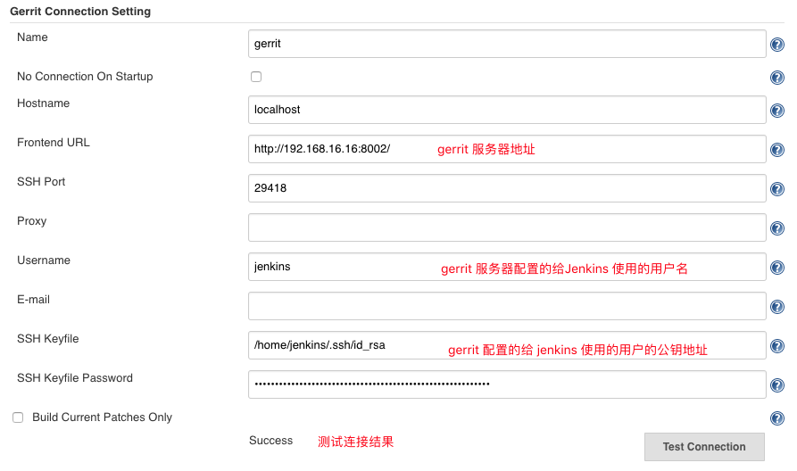
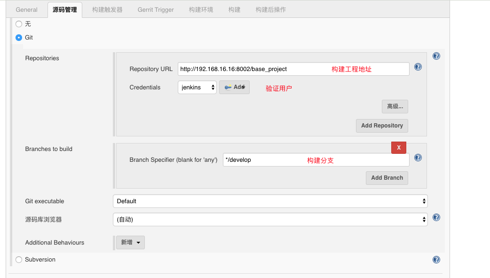
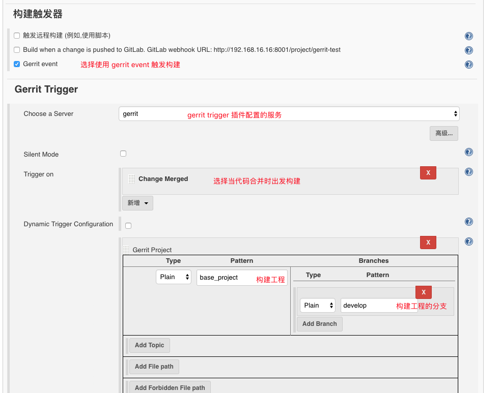
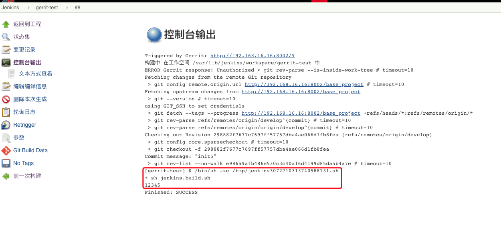

# gerrit + jenkins 实现 CI

---
版本说明:
 * centos: 7.5（虚拟机）
 * gerrit: 2.15.4
 * jenkins: 2.138.1
 * JDK: 1.8

## 安装

### gerrit 安装
gerrit 安装
```sh
wget https://gerrit-releases.storage.googleapis.com/gerrit-2.15.4.war
java -jar gerrit-2.15.4.war init -d ~/gerrit_review
```

gerrit 安装好后需要安装 `events-log` 插件，因为与 jenkins 通信时需要该插件。gerrit 没有内置该插件，同时也没有提供该插件的 jar 包，自己编译环境配置复杂，可以从下面链接中找到该插件的各种 jar 包版本，[地址](https://gerrit-ci.gerritforge.com/)。

将下载好的 jar 包放进`plugins`目录，重启 gerrit。


登陆 gerrit 查看插件是否安装成功


### jenkins 安装
jenkins 安装
```sh
wget -O /etc/yum.repos.d/jenkins.repo https://pkg.jenkins.io/redhat-stable/jenkins.repo
rpm --import https://pkg.jenkins.io/redhat-stable/jenkins.io.key

yum install jenkins

service jenkins start
```

Jenkins 安装 gerrit trigger 插件，安装后查看已安装插件，看是否安装成功


## 配置

1.新建 gerrit 用户
gerrit 新建用户 jenkins, 并给 jenkins 用户添加权限，该用户将配置给 jenkins 与 gerrit 通信，在stream events 中给添加 jenkins用户，使得 jenkins用户 能够有权限监听 gerrit 的 Stream Events的事件。


2.配置 jenkins 的 gerrit trigger 插件
给 gerrit trigger 插件添加 server


3.创建 job
jenkins 上新建构建任务

配置触发器

选择构建脚本，构建脚本选择工程中的`jenkins.build.sh`文件


配置完毕后选择保存

## 构建
在 base_project 工程下新建文件`jenkins.build.sh`，内容如下
```sh
#!/bin/bash

echo 12345
```
保存代码提交，合并代码，可以看到 jenkins 上开始触发构建，打开构建任务控制台输出

可以看到代码合并成功出发了 jenkins 构建
