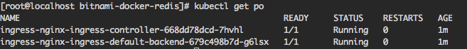
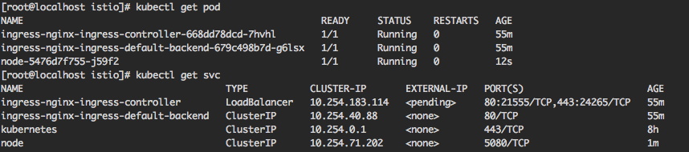

## 介绍 

## 使用 helm 安装 istio

```sh
helm install stable/nginx-ingress --name ingress

# 如果 kubernetes 使用 RBAC 鉴权则需要添加 rbac.create 参数
helm install stable/nginx-ingress --name ingress --set rbac.create=true
```

查看安装结果
```sh
kubectl get po
```


## 使用
1. 创建服务
```sh
mkdir ingress
cd ingress
touch node-service.yaml
touch node-deployment.yaml
```
service yaml 文件如下
```yaml
apiVersion: v1
kind: Service
metadata:
  name: node
spec:
  ports:
  - port: 5080
    targetPort: 5080
  selector:
    name: node
```
deployment yaml 文件如下
```yaml
apiVersion: extensions/v1beta1
kind: Deployment
metadata:
  name: node
spec:
  replicas: 1
  template:
    metadata:
      labels:
        app: node
    spec:
      containers:
      - name: node-node
        image: node-test:v1         # 镜像启动后监听 5080 端口
        imagePullPolicy: IfNotPresent
        ports:
          - containerPort: 5080
```
启动服务
```sh
kubectl create -f .
```
查看启动情况


2. 创建 ingress 服务

创建 ingress yaml 文件
```sh
touch ingress.yaml
```
ingress 服务 yaml 文件如下：
```yaml
apiVersion: extensions/v1beta1
kind: Ingress
metadata:
  name: test-ingress
spec:
  rules:
  - host: ingress.node.cc
    http:
      paths:
      - backend:
          serviceName: node
          servicePort: 5080
```