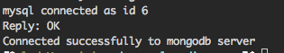

# node + mongo + redis + mysql

---

### 1.服务目录如下
```sh
node_mysql_redis_mongo/
├── Dockerfile            # 打包文件
├── docker-compose.yaml   # service 文件
├── root
│   ├── bin               
│   │   └── run.sh        # 服务启动文件
│   └── server            # 服务文件
│       ├── app.js
│       ├── package-lock.json
│       └── package.json
└── start.sh              # 工程启动文件
```
#### 1.1 Dockerfile 文件

```Dockerfile
FROM centos
RUN yum -y update; yum clean all
RUN yum -y install epel-release; yum clean all
RUN yum -y install nodejs npm; yum clean all

ADD root/ /opt/
```
#### 1.2 docker-compose.yaml文件如下

```yaml
version: "3.3"
services:
  mysql:
    image: mysql:5.7
    restart: always
    environment:
      MYSQL_ROOT_PASSWORD: $Cai3564423        # mysql服务root用户初始密码
    expose:                                   # expose是暴露服务给docker-compose其他服务用，不会暴露到服务外面，ports会暴露端口到服务外面
      - 3306
    volumes:
      - /Users/clx/dockerVolume/mysql:/var/lib/mysql    # 将 mysql数据挂载到本机/Users/clx/dockerVolume/mysql目录
  redis:
    image: redis:4.0
    restart: always
    expose:
      - 6379
    volumes:
      - /Users/clx/dockerVolume/redis/:/data
  mongo:
    image: mongo:3.6
    restart: always
    environment:
      - MONGO_DATA_DIR=/data/db
      - MONGO_LOG_DIR=/data/db/log
    expose:
      - 27017
    volumes: 
      - /Users/clx/dockerVolume/mongo/:/data/db
  server:                     # 应用名称
    build: .
    entrypoint: "bash -c"
    depends_on:         # docker-compose会将depends_on的容器先启动
      - mysql
      - redis
      - mongo
    environment:
      MYSQL_HOST: mysql
      MYSQL_ROOT_PASSWORD: $Cai3564423
      MONGO_HOST: mongo
      REDIS_HOST: redis

```

#### 1.3 run.sh 文件

```sh
cd /opt/server
npm install
node app.js
```

#### 1.4 app.js文件

```js
const mysql = require("mysql");
const connection = mysql.createConnection({
  host: process.env.MYSQL_HOST || "127.0.0.1",
  user: "root",
  password: process.env.MYSQL_ROOT_PASSWORD || "@Cai3564423"
});

connection.connect(function(err) {
  if (err) {
    console.error("mysql error connecting: " + err.stack);
    return;
  }

  console.log("mysql connected as id " + connection.threadId);
});

const MongoClient = require("mongodb");
const url = `mongodb://${process.env.MONGO_HOST}:27017`;

// Use connect method to connect to the server
MongoClient.connect(
  url,
  function(err, client) {
    if (err) {
      console.log("connected faild to mongodb server");
    } else {
      console.log("Connected successfully to mongodb server");
    }
  }
);

const redis = require("redis");
const client = redis.createClient({
  host: process.env.REDIS_HOST || "127.0.0.1",
  port: "6379"
});

// if you'd like to select database 3, instead of 0 (default), call
// client.select(3, function() { /* ... */ });

client.on("error", function(err) {
  console.log("Error " + err);
});

client.set("string key", "string val", redis.print);
```

#### 1.5 package-lock.json

```json
{
  "name": "node_mysql_redis_mongo",
  "version": "1.0.0",
  "lockfileVersion": 1,
  "requires": true,
  "dependencies": {
    "async": {
      "version": "2.6.1",
      "resolved": "https://registry.npmjs.org/async/-/async-2.6.1.tgz",
      "integrity": "sha512-fNEiL2+AZt6AlAw/29Cr0UDe4sRAHCpEHh54WMz+Bb7QfNcFw4h3loofyJpLeQs4Yx7yuqu/2dLgM5hKOs6HlQ==",
      "requires": {
        "lodash": "^4.17.10"
      }
    },
    "bignumber.js": {
      "version": "4.1.0",
      "resolved": "https://registry.npmjs.org/bignumber.js/-/bignumber.js-4.1.0.tgz",
      "integrity": "sha512-eJzYkFYy9L4JzXsbymsFn3p54D+llV27oTQ+ziJG7WFRheJcNZilgVXMG0LoZtlQSKBsJdWtLFqOD0u+U0jZKA=="
    },
    "bluebird": {
      "version": "3.5.1",
      "resolved": "https://registry.npmjs.org/bluebird/-/bluebird-3.5.1.tgz",
      "integrity": "sha512-MKiLiV+I1AA596t9w1sQJ8jkiSr5+ZKi0WKrYGUn6d1Fx+Ij4tIj+m2WMQSGczs5jZVxV339chE8iwk6F64wjA=="
    },
    "bson": {
      "version": "1.0.9",
      "resolved": "https://registry.npmjs.org/bson/-/bson-1.0.9.tgz",
      "integrity": "sha512-IQX9/h7WdMBIW/q/++tGd+emQr0XMdeZ6icnT/74Xk9fnabWn+gZgpE+9V+gujL3hhJOoNrnDVY7tWdzc7NUTg=="
    },
    "core-util-is": {
      "version": "1.0.2",
      "resolved": "https://registry.npmjs.org/core-util-is/-/core-util-is-1.0.2.tgz",
      "integrity": "sha1-tf1UIgqivFq1eqtxQMlAdUUDwac="
    },
    "debug": {
      "version": "3.1.0",
      "resolved": "https://registry.npmjs.org/debug/-/debug-3.1.0.tgz",
      "integrity": "sha512-OX8XqP7/1a9cqkxYw2yXss15f26NKWBpDXQd0/uK/KPqdQhxbPa994hnzjcE2VqQpDslf55723cKPUOGSmMY3g==",
      "requires": {
        "ms": "2.0.0"
      }
    },
    "double-ended-queue": {
      "version": "2.1.0-0",
      "resolved": "https://registry.npmjs.org/double-ended-queue/-/double-ended-queue-2.1.0-0.tgz",
      "integrity": "sha1-ED01J/0xUo9AGIEwyEHv3XgmTlw="
    },
    "inherits": {
      "version": "2.0.3",
      "resolved": "https://registry.npmjs.org/inherits/-/inherits-2.0.3.tgz",
      "integrity": "sha1-Yzwsg+PaQqUC9SRmAiSA9CCCYd4="
    },
    "isarray": {
      "version": "1.0.0",
      "resolved": "https://registry.npmjs.org/isarray/-/isarray-1.0.0.tgz",
      "integrity": "sha1-u5NdSFgsuhaMBoNJV6VKPgcSTxE="
    },
    "kareem": {
      "version": "2.2.1",
      "resolved": "https://registry.npmjs.org/kareem/-/kareem-2.2.1.tgz",
      "integrity": "sha512-xpDFy8OxkFM+vK6pXy6JmH92ibeEFUuDWzas5M9L7MzVmHW3jzwAHxodCPV/BYkf4A31bVDLyonrMfp9RXb/oA=="
    },
    "lodash": {
      "version": "4.17.10",
      "resolved": "https://registry.npmjs.org/lodash/-/lodash-4.17.10.tgz",
      "integrity": "sha512-UejweD1pDoXu+AD825lWwp4ZGtSwgnpZxb3JDViD7StjQz+Nb/6l093lx4OQ0foGWNRoc19mWy7BzL+UAK2iVg=="
    },
    "lodash.get": {
      "version": "4.4.2",
      "resolved": "https://registry.npmjs.org/lodash.get/-/lodash.get-4.4.2.tgz",
      "integrity": "sha1-LRd/ZS+jHpObRDjVNBSZ36OCXpk="
    },
    "mongodb": {
      "version": "3.1.3",
      "resolved": "https://registry.npmjs.org/mongodb/-/mongodb-3.1.3.tgz",
      "integrity": "sha512-hfzI54/fe+604w5gP+i9aJ5GGVxnquxZ09ZN1cyLTbpnBfDRpj78lN59SBdDRkF1VNTzmM2KcgDWhHHDHcsJxw==",
      "requires": {
        "mongodb-core": "3.1.2"
      }
    },
    "mongodb-core": {
      "version": "3.1.2",
      "resolved": "https://registry.npmjs.org/mongodb-core/-/mongodb-core-3.1.2.tgz",
      "integrity": "sha512-R2XxGzsmhlUeOK2jKATj1TWn3q3qNcJpKrSh0rhaBSHxJmV7WZ+ikjocdY8VdJxUkKqOxM8rxMqOAEzeJ3p1ww==",
      "requires": {
        "bson": "^1.1.0",
        "require_optional": "^1.0.1",
        "saslprep": "^1.0.0"
      },
      "dependencies": {
        "bson": {
          "version": "1.1.0",
          "resolved": "https://registry.npmjs.org/bson/-/bson-1.1.0.tgz",
          "integrity": "sha512-9Aeai9TacfNtWXOYarkFJRW2CWo+dRon+fuLZYJmvLV3+MiUp0bEI6IAZfXEIg7/Pl/7IWlLaDnhzTsD81etQA=="
        }
      }
    },
    "mongoose": {
      "version": "5.2.9",
      "resolved": "https://registry.npmjs.org/mongoose/-/mongoose-5.2.9.tgz",
      "integrity": "sha512-PqXYKtXq5VPJDf7pUuCfTjN5MVEE0Dyia+YrqkI/FU8kk7YmZbGIedbvw7HHn+EKFSD2N137djhbH0NJ7FNA5Q==",
      "requires": {
        "async": "2.6.1",
        "bson": "~1.0.5",
        "kareem": "2.2.1",
        "lodash.get": "4.4.2",
        "mongodb": "3.1.3",
        "mongodb-core": "3.1.2",
        "mongoose-legacy-pluralize": "1.0.2",
        "mpath": "0.4.1",
        "mquery": "3.1.2",
        "ms": "2.0.0",
        "regexp-clone": "0.0.1",
        "safe-buffer": "5.1.2",
        "sliced": "1.0.1"
      }
    },
    "mongoose-legacy-pluralize": {
      "version": "1.0.2",
      "resolved": "https://registry.npmjs.org/mongoose-legacy-pluralize/-/mongoose-legacy-pluralize-1.0.2.tgz",
      "integrity": "sha512-Yo/7qQU4/EyIS8YDFSeenIvXxZN+ld7YdV9LqFVQJzTLye8unujAWPZ4NWKfFA+RNjh+wvTWKY9Z3E5XM6ZZiQ=="
    },
    "mpath": {
      "version": "0.4.1",
      "resolved": "https://registry.npmjs.org/mpath/-/mpath-0.4.1.tgz",
      "integrity": "sha512-NNY/MpBkALb9jJmjpBlIi6GRoLveLUM0pJzgbp9vY9F7IQEb/HREC/nxrixechcQwd1NevOhJnWWV8QQQRE+OA=="
    },
    "mquery": {
      "version": "3.1.2",
      "resolved": "https://registry.npmjs.org/mquery/-/mquery-3.1.2.tgz",
      "integrity": "sha512-rBo2+eShI/Ko/GFzXMvJvYjzeLRW3P7E4NllAGRyNO90Xw5awo5RI3zCqzuJWe1NSvdL7cGu3RPLuGjZ1TmnmA==",
      "requires": {
        "bluebird": "3.5.1",
        "debug": "3.1.0",
        "regexp-clone": "0.0.1",
        "sliced": "1.0.1"
      }
    },
    "ms": {
      "version": "2.0.0",
      "resolved": "https://registry.npmjs.org/ms/-/ms-2.0.0.tgz",
      "integrity": "sha1-VgiurfwAvmwpAd9fmGF4jeDVl8g="
    },
    "mysql": {
      "version": "2.16.0",
      "resolved": "https://registry.npmjs.org/mysql/-/mysql-2.16.0.tgz",
      "integrity": "sha512-dPbN2LHonQp7D5ja5DJXNbCLe/HRdu+f3v61aguzNRQIrmZLOeRoymBYyeThrR6ug+FqzDL95Gc9maqZUJS+Gw==",
      "requires": {
        "bignumber.js": "4.1.0",
        "readable-stream": "2.3.6",
        "safe-buffer": "5.1.2",
        "sqlstring": "2.3.1"
      }
    },
    "process-nextick-args": {
      "version": "2.0.0",
      "resolved": "https://registry.npmjs.org/process-nextick-args/-/process-nextick-args-2.0.0.tgz",
      "integrity": "sha512-MtEC1TqN0EU5nephaJ4rAtThHtC86dNN9qCuEhtshvpVBkAW5ZO7BASN9REnF9eoXGcRub+pFuKEpOHE+HbEMw=="
    },
    "readable-stream": {
      "version": "2.3.6",
      "resolved": "https://registry.npmjs.org/readable-stream/-/readable-stream-2.3.6.tgz",
      "integrity": "sha512-tQtKA9WIAhBF3+VLAseyMqZeBjW0AHJoxOtYqSUZNJxauErmLbVm2FW1y+J/YA9dUrAC39ITejlZWhVIwawkKw==",
      "requires": {
        "core-util-is": "~1.0.0",
        "inherits": "~2.0.3",
        "isarray": "~1.0.0",
        "process-nextick-args": "~2.0.0",
        "safe-buffer": "~5.1.1",
        "string_decoder": "~1.1.1",
        "util-deprecate": "~1.0.1"
      }
    },
    "redis": {
      "version": "2.8.0",
      "resolved": "https://registry.npmjs.org/redis/-/redis-2.8.0.tgz",
      "integrity": "sha512-M1OkonEQwtRmZv4tEWF2VgpG0JWJ8Fv1PhlgT5+B+uNq2cA3Rt1Yt/ryoR+vQNOQcIEgdCdfH0jr3bDpihAw1A==",
      "requires": {
        "double-ended-queue": "^2.1.0-0",
        "redis-commands": "^1.2.0",
        "redis-parser": "^2.6.0"
      }
    },
    "redis-commands": {
      "version": "1.3.5",
      "resolved": "https://registry.npmjs.org/redis-commands/-/redis-commands-1.3.5.tgz",
      "integrity": "sha512-foGF8u6MXGFF++1TZVC6icGXuMYPftKXt1FBT2vrfU9ZATNtZJ8duRC5d1lEfE8hyVe3jhelHGB91oB7I6qLsA=="
    },
    "redis-parser": {
      "version": "2.6.0",
      "resolved": "https://registry.npmjs.org/redis-parser/-/redis-parser-2.6.0.tgz",
      "integrity": "sha1-Uu0J2srBCPGmMcB+m2mUHnoZUEs="
    },
    "regexp-clone": {
      "version": "0.0.1",
      "resolved": "https://registry.npmjs.org/regexp-clone/-/regexp-clone-0.0.1.tgz",
      "integrity": "sha1-p8LgmJH9vzj7sQ03b7cwA+aKxYk="
    },
    "require_optional": {
      "version": "1.0.1",
      "resolved": "https://registry.npmjs.org/require_optional/-/require_optional-1.0.1.tgz",
      "integrity": "sha512-qhM/y57enGWHAe3v/NcwML6a3/vfESLe/sGM2dII+gEO0BpKRUkWZow/tyloNqJyN6kXSl3RyyM8Ll5D/sJP8g==",
      "requires": {
        "resolve-from": "^2.0.0",
        "semver": "^5.1.0"
      }
    },
    "resolve-from": {
      "version": "2.0.0",
      "resolved": "https://registry.npmjs.org/resolve-from/-/resolve-from-2.0.0.tgz",
      "integrity": "sha1-lICrIOlP+h2egKgEx+oUdhGWa1c="
    },
    "safe-buffer": {
      "version": "5.1.2",
      "resolved": "https://registry.npmjs.org/safe-buffer/-/safe-buffer-5.1.2.tgz",
      "integrity": "sha512-Gd2UZBJDkXlY7GbJxfsE8/nvKkUEU1G38c1siN6QP6a9PT9MmHB8GnpscSmMJSoF8LOIrt8ud/wPtojys4G6+g=="
    },
    "saslprep": {
      "version": "1.0.1",
      "resolved": "https://registry.npmjs.org/saslprep/-/saslprep-1.0.1.tgz",
      "integrity": "sha512-ntN6SbE3hRqd45PKKadRPgA+xHPWg5lPSj2JWJdJvjTwXDDfkPVtXWvP8jJojvnm+rAsZ2b299C5NwZqq818EA==",
      "optional": true
    },
    "semver": {
      "version": "5.5.1",
      "resolved": "https://registry.npmjs.org/semver/-/semver-5.5.1.tgz",
      "integrity": "sha512-PqpAxfrEhlSUWge8dwIp4tZnQ25DIOthpiaHNIthsjEFQD6EvqUKUDM7L8O2rShkFccYo1VjJR0coWfNkCubRw=="
    },
    "sliced": {
      "version": "1.0.1",
      "resolved": "https://registry.npmjs.org/sliced/-/sliced-1.0.1.tgz",
      "integrity": "sha1-CzpmK10Ewxd7GSa+qCsD+Dei70E="
    },
    "sqlstring": {
      "version": "2.3.1",
      "resolved": "https://registry.npmjs.org/sqlstring/-/sqlstring-2.3.1.tgz",
      "integrity": "sha1-R1OT/56RR5rqYtyvDKPRSYOn+0A="
    },
    "string_decoder": {
      "version": "1.1.1",
      "resolved": "https://registry.npmjs.org/string_decoder/-/string_decoder-1.1.1.tgz",
      "integrity": "sha512-n/ShnvDi6FHbbVfviro+WojiFzv+s8MPMHBczVePfUpDJLwoLT0ht1l4YwBCbi8pJAveEEdnkHyPyTP/mzRfwg==",
      "requires": {
        "safe-buffer": "~5.1.0"
      }
    },
    "util-deprecate": {
      "version": "1.0.2",
      "resolved": "https://registry.npmjs.org/util-deprecate/-/util-deprecate-1.0.2.tgz",
      "integrity": "sha1-RQ1Nyfpw3nMnYvvS1KKJgUGaDM8="
    }
  }
}
```

#### 1.6 package.json 文件

```json
{
  "name": "node_mysql_redis_mongo",
  "version": "1.0.0",
  "description": "",
  "main": "app.js",
  "scripts": {
    "test": "echo \"Error: no test specified\" && exit 1"
  },
  "keywords": [],
  "author": "",
  "license": "ISC",
  "dependencies": {
    "mongodb": "^3.1.3",
    "mongoose": "^5.2.9",
    "mysql": "^2.16.0",
    "redis": "^2.8.0"
  }
}
```

### 1.7 start.sh 文件

```sh
docker-compose build                        # 构建服务
docker-compose run server /opt/bin/run.sh   # 启动server(yaml文件里面定义的名称)服务里面的 /opt/bin/run.sh 文件
```

### 2.输出结果

