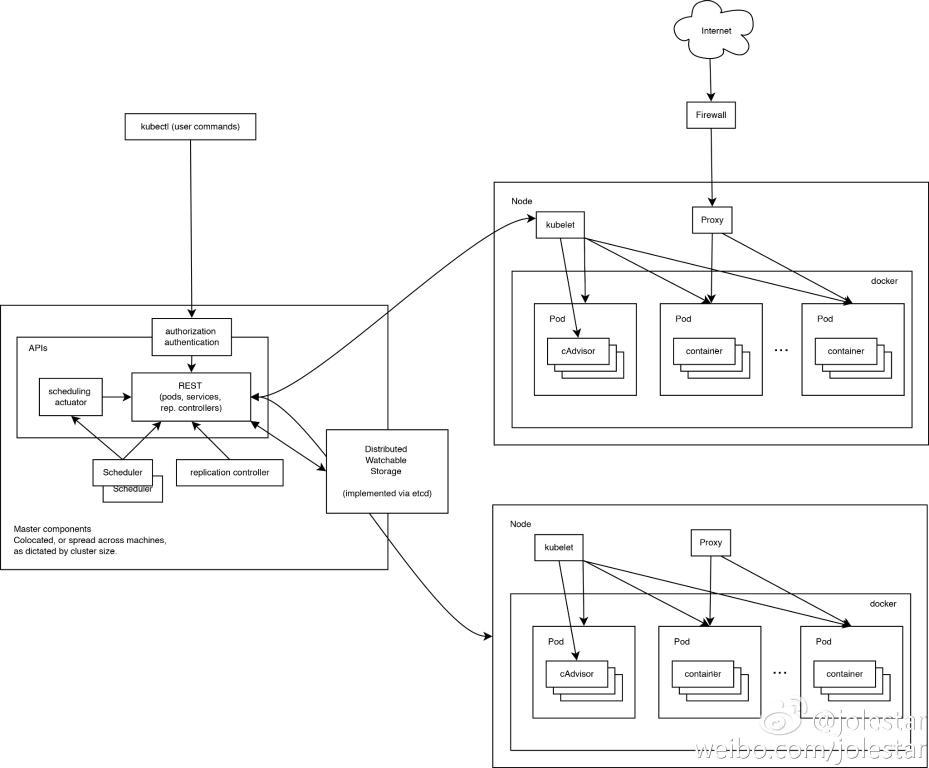

# API Server

API Server 的核心功能是提供了 Kubernetes 各类资源对象(如: pod 、RC、Service等)的增删改查以及 watch 等 HTTP Rest 接口；是集群内各个功能模块之间数据交互和通信的中心枢纽；*是整个系统的数据总线和数据中心*；同时还兼具以下功能:
 * 集群管理的 API 入口
 * 资源配额控制的入口
 * 提供了完备的集群安全配置


Kubernetes API Server 通过一个名为 kube-apiserver 的进程提供服务，该进程运行在 master 节点上，默认情况 kube-apiserver 使用本机的 8080 端口(对应参数 --insecure-port)对外提供读物，也可以同时启用 HTTPS 安全端口(--insecure-port=6443)来启动安全机制。

kube-apiserver 常用启动参数介绍
|参数|说明|
|--|--|
|enable-admission-plugins|对发送给 api-server 的请求进行准入控制，多个准入控制器以逗号进行分割，按照准入控制器顺序对请求进行过滤和拦截|
|anonymous-auth|设置为 true 时表示 api-server 允许接受没有进行鉴权的匿名请求，默认为 true|
|experimental-encryption-provider-config||
|advertise-address|用户广播给所有成员自己的 IP 地址，不指定将使用 bind-address 定义的 IP 地址|
|bind-address|api-server 在该地址的 6443 端口开启安全的 HTTPS 服务，默认为 0.0.0.0|
|insecure-port|提供非安全访问的监听端口，默认为 8080|
|authorization-mode|api-server 认证模式，可以选多个，通过逗号分割，默认为 AlwaysAllow|
|runtime-config|一组 kay=value 用于运行时的配置信息，可用户打开或关闭对某个 API 版本的支持|
|enable-bootstrap-token-auth|允许以 token 的形式对 kube-system 命名空间内的服务进行认证|
|service-node-port-range|service 的 nodePort 能使用的主机端口号范围，默认为 30000-32767|
|tls-cert-file|证书文件|
|tls-private-key-file|私钥文件|
|client-ca-file|客户端证书|
|kubelet-client-certificate|kubelet 客户端证书|
|kubelet-client-key|客户端密钥文件|
|service-account-key-file|密钥文件，用于验证 service account的token|
|etcd-cafile|到 etcd 安全连接使用的 SSL CA 文件|
|etcd-certfile|到 etcd 安全连接使用的 SSL 证书文件|
|etcd-keyfile|到 etcd 安全连接使用的 SSL 密钥文件|
|etcd-servers|到 etcd 服务器地址，多个以逗号分割|
|enable-swagger-ui|为 true 表示气功 swagger |
|allow-privileged|为 true 表示允许 pod 中运行拥有系统特权的容器应用|
|apiserver-count|运行 api-server 的数量|
|audit-log-maxage|审计日志文件保留最长天数|
|audit-log-maxbackup|审计日志文件个数|
|audit-log-maxsize|审计日志单个大小限制，单位为 MB，默认为 100 MB|
|audit-log-path|审计日志文件全路径|
|event-ttl|api-server中各种事件在系统中保存的时间|
|alsologtostderr|是否将日志输出到 stderr，而非文件|
|logtostderr|为 true 表示日志信息输出到 stderr,而非文件|
|log-dir|日志地址|
|v||

## kube-apiserve 常用接口介绍
| uri                           | 功能                            |
| ----------------------------- | ------------------------------- |
| /api/v1                       | 查看支持的资源对象种类          |
| /api/v1/pods                  | 查看 pods 列表                  |
| /api/v1/services              | 查看 services 列表              |
| /api/v1/replicationcontroller | 查看 replicationcontroller 列表 |

## kubenetes proxy API 接口
Kubernetes API 可以把收到的接口转发到某个 Node 上的 Kubelet REST 端口上，查看 Node 上的信息，接口路径为`/api/v1/proxy/nodes/{name}`,{name}为节点的名称或 IP 地址

| uri                              | 功能                         |
| -------------------------------- | ---------------------------- |
| /api/v1/proxy/nodes/{name}/pods  | 列出节点内所有 pod 的信息    |
| /api/v1/proxy/nodes/{name}/stats | 列出节点内屋里资源的统计信息 |
| /api/v1/proxy/nodes/{name}/spec  | 列出节点的概要信息           |

## systemd unit 示例文件
```sh
cat > kube-apiserver.service.template <<EOF
[Unit]
Description=Kubernetes API Server
Documentation=https://github.com/GoogleCloudPlatform/kubernetes
After=network.target

[Service]
ExecStart=/opt/k8s/bin/kube-apiserver \\
  --enable-admission-plugins=Initializers,NamespaceLifecycle,NodeRestriction,LimitRanger,ServiceAccount,DefaultStorageClass,ResourceQuota \\
  --anonymous-auth=false \\
  --experimental-encryption-provider-config=/etc/kubernetes/encryption-config.yaml \\
  --advertise-address=##NODE_IP## \\
  --bind-address=##NODE_IP## \\
  --insecure-port=0 \\
  --authorization-mode=Node,RBAC \\
  --runtime-config=api/all \\
  --enable-bootstrap-token-auth \\
  --service-cluster-ip-range=${SERVICE_CIDR} \\
  --service-node-port-range=${NODE_PORT_RANGE} \\
  --tls-cert-file=/etc/kubernetes/cert/kubernetes.pem \\
  --tls-private-key-file=/etc/kubernetes/cert/kubernetes-key.pem \\
  --client-ca-file=/etc/kubernetes/cert/ca.pem \\
  --kubelet-client-certificate=/etc/kubernetes/cert/kubernetes.pem \\
  --kubelet-client-key=/etc/kubernetes/cert/kubernetes-key.pem \\
  --service-account-key-file=/etc/kubernetes/cert/ca-key.pem \\
  --etcd-cafile=/etc/kubernetes/cert/ca.pem \\
  --etcd-certfile=/etc/kubernetes/cert/kubernetes.pem \\
  --etcd-keyfile=/etc/kubernetes/cert/kubernetes-key.pem \\
  --etcd-servers=${ETCD_ENDPOINTS} \\
  --enable-swagger-ui=true \\
  --allow-privileged=true \\
  --apiserver-count=3 \\
  --audit-log-maxage=30 \\
  --audit-log-maxbackup=3 \\
  --audit-log-maxsize=100 \\
  --audit-log-path=/var/log/kube-apiserver-audit.log \\
  --event-ttl=1h \\
  --alsologtostderr=true \\
  --logtostderr=false \\
  --log-dir=/var/log/kubernetes \\
  --v=2
Restart=on-failure
RestartSec=5
Type=notify
User=k8s
LimitNOFILE=65536

[Install]
WantedBy=multi-user.target
EOF
```

## 集群功能模块之间通信


从上图可以看出，API Server作为集群的核心，负责集群各功能模块之间的通信，集群内的各个功能模块通过 API Server 将信息存入 etcd ，当需要获取和操作这些数据时，通过 API Server 提供的 REST 接口来实现。

为了缓解集群各模块对 API Server 的访问压力，各功能模块都采用缓存机制来缓存数据，各功能模块定时从 API Server 获取指定的资源对象信息，然后将这些信息保存到本地缓存，功能模块在某些情况下不直接访问 API Server，而是通过访问本地缓存数据来间接访问 API Server。

### kubelet 与 API Server 之间通信
每个 Node 节点上的 kubelet 每隔一个时间周期，就会调用一次 API Server 的 REST 接口报告自身状态，API Server 接收到这些信息后，将节点信息更新到 etcd 中；同时，kubelet 调用 API Server 的 watch 接口监听 pod 信息，如果监听到新的 pod 副本被调度到本节点，则执行 pod 对应的容器的创建和启动逻辑；如果监听到 pod 对象被删除，则删除本节点上的相应的 pod 容器；如果监听到更新 pod  信息，则更新 pod。

### kube-controller-manager 与 API Server 通信
kube-controller-manager 中的 Node Controller 模块通过 API Server 提供的 watch 接口，实时监控 Node 的信息，并对结果进行相应的处理。

### kube-scheduler 与 API Server 通信
当 Scheduler 通过 API Server 的 watch 接口监听新建 pod 副本的信息后，检索所有符合该 pod 要求的 Node 列表，开始执行 pod 调度逻辑，调度成功后将 pod 绑定到目标节点上。