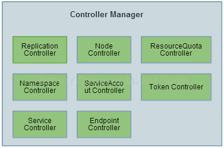

# Controller Manager

Controller Manager 是集群内部的管理控制中心，负责集群内部的 Node、Pod副本、服务器点(Endpoint)、命名空间、服务账号(ServiceAccount)、资源定额(ResourceQuota)等的管理，当某个 Node 意外宕机时，Controller Mangaer 会即使发现此故障并执行自动化修复流程，确保集群始终处理预计的工作状态。

Controller Mangaer 结构图如下


Controller Manager 内部包含如下多个 Controller，Controlelr Manager 是这些 Controlelr 的核心管理者
 * Replication Controller
 * Node Controller
 * ResourceQuota Controller
 * Namespace Controller
 * ServiceAccount Controlelr
 * Token Controlelr
 * Service Controlelr
 * Endpoint Controlelr

## systemd unit 示例文件
```sh
cat > kube-controller-manager.service <<EOF
[Unit]
Description=Kubernetes Controller Manager
Documentation=https://github.com/GoogleCloudPlatform/kubernetes

[Service]
ExecStart=/opt/k8s/bin/kube-controller-manager \\
  --port=0 \\
  --secure-port=10252 \\
  --bind-address=127.0.0.1 \\ 
  --kubeconfig=/etc/kubernetes/kube-controller-manager.kubeconfig \\
  --service-cluster-ip-range=${SERVICE_CIDR} \\
  --cluster-name=kubernetes \\
  --cluster-signing-cert-file=/etc/kubernetes/cert/ca.pem \\
  --cluster-signing-key-file=/etc/kubernetes/cert/ca-key.pem \\
  --experimental-cluster-signing-duration=8760h \\
  --root-ca-file=/etc/kubernetes/cert/ca.pem \\
  --service-account-private-key-file=/etc/kubernetes/cert/ca-key.pem \\
  --leader-elect=true \\
  --feature-gates=RotateKubeletServerCertificate=true \\
  --controllers=*,bootstrapsigner,tokencleaner \\
  --horizontal-pod-autoscaler-use-rest-clients=true \\
  --horizontal-pod-autoscaler-sync-period=10s \\
  --tls-cert-file=/etc/kubernetes/cert/kube-controller-manager.pem \\
  --tls-private-key-file=/etc/kubernetes/cert/kube-controller-manager-key.pem \\
  --use-service-account-credentials=true \\
  --alsologtostderr=true \\
  --logtostderr=false \\
  --log-dir=/var/log/kubernetes \\
  --v=2
Restart=on
Restart=on-failure
RestartSec=5
User=k8s

[Install]
WantedBy=multi-user.target
EOF
```