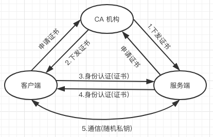
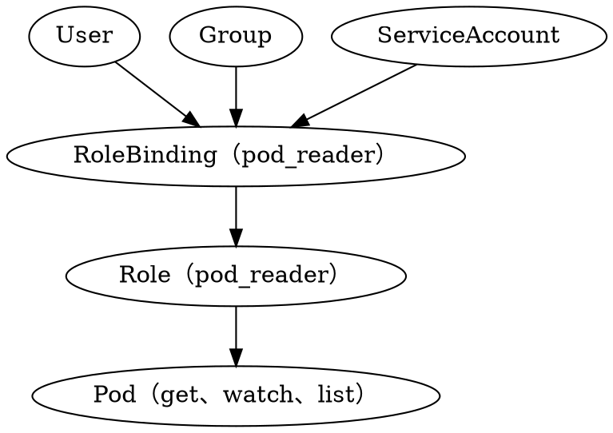

# Kubernetes 安全机制

## API Server 认证管理（Authentication）
由于 Kubernetes 中所有资源的访问和变更都是通过 Kubernetes API Server 的 Rest API 来实现实现的，所有集群安全的关键点在于如何识别并认证(Authentication)客户端身份，并对随后的访问进行授权(Authorization)这两个问题

Kubernetes 提供三种级别的客户端身份认证方式

 * 最严格的 HTTPS 证书认证: 基于 CA 根证书签名的双向数字证书认证方式
 * HTTP Token 认证: 通过一个 Token 来识别合法用户
 * HTTP Base 认证: 通过用户名 + 密码的方式认证

CA 证书流程如下:


1. HTTPS 通信双方的服务器端向 CA 机构申请证书，CA机构是可信的第三方机构，CA机构下发根证书、服务器端证书及私钥给申请者
2. HTTPS 通信双方的客户端向 CA 机构申请证书，CA 机构下发根证书、客户端证书及私钥给申请者
3. 客户端向服务器端发起请求，服务器端下发服务端证书给客户端，客户端接收到证书后，通过私钥解密证书。并利用服务气短证书中的公钥认证证书信息比较证书里的消息，例如域名和公钥与服务器刚刚发送的相关消息是否一致，如果一致，则客户端认可这个服务器的合法身份
4. 客户端发送客户端证书给服务器端，服务器端接收到证书后，通过私钥解密证书，获得客户端证书公钥，并用该公钥认证证书信息，确认客户端是否合法
5. 客户端通过随机密钥加密信息，并发送加密后的信息给服务端，服务端和客户端协商加密方案后，客户端回产生一个随机的密钥，客户端通过协商好的加密方案，加密该随机密钥，并发送该随机密钥到服务器端，服务器端接受这个密钥后，双发通信的所有内容都通过该随机密钥加密

双向认证 SSL 协议的具体通信过程要求服务器端和用户双发都有证书，单向认证 SSL 协议不需要客户端拥有 CA 证书

## API Server 授权管理 (Authorization)

客户端发起 API Server 调用时， API Server 内部先进行用户认证，认证通过后进行用户授权，并在用户随后的访问中对用户进行鉴权，API Server 目前支持以下集中授权策略（通过 API Server 的启动参数 --authorization-mode 进行设置）

 * AlwaysDeny: 拒绝所有请求
 * AlwaysAllow: 允许所有请求
 * ABAC（Attribute-Base Access Control）:基于属性的访问控制，表示使用用户配置的授权规则对用户进行匹配和控制
 * Webhook: 调用外部 REST 服务进行授权
 * RBAC（Role-Based Access Control）: 基于角色的访问控制

### RBAC 授权模式
RBAC 模式具有如下优势:

 * 对整个集群中的资源和非资源权限均具有完整的覆盖
 * 整个 RBAC 完全由几个 API 对象完成，同其他 API 对象一样，可以用 kubectl 或 API 进行操作
 * 可以在运行时进行调整，无须重新启动 API Server

要使用 RBAC 授权模式，需要在 API Server 的启动参数中加上 --authorization-mode=RBAC

#### RBAC 的 API 资源对象说明
RBAC 引入了4个新的顶级资源对象: Role、ClusterRole、RoleBinding、ClusterRoleBinding

1. Role

一个角色是一组权限的集合，这里的权限都时许可形式的，没有拒绝形式，在一个命名空间中，可以使用角色来定义一个角色，如果时集群级别的，需要使用 ClusterRole；角色可以只能对命名空间内的资源进行授权
```yaml
kind: Role
apiVersion: rbac.authorization.k8s.io/v1
metadata:
  namespace: default
  name: pod-reader
rules:
- apiGroups: [""]
  resources: ["pods"]
  verbs: ["get", "watch", "list"]
```
上面 yaml 参数说明:
 * apiGroups: 支持的 API 组列表，如: "apiVersion: batch/v1"、"apiVersion: extensions:v1beta1"、"apiVersion:apps/v1beta1"等
 * resources: 支持的资源对象列表，如: pods、deployments、jobs等
 * verbs: 对资源对象的操作方法列表，如: get、watch、list、delete、replace、patch等

2. ClusterRole
集群角色从护理具有和角色一致的命名空间内资源的管理能力，因其集群级别的范围，还可以用于以下特殊元素的授权

 * 集群范围的资源，如: Node
 * 非资源型的路径，如: "healthz"
 * 包含全部命名空间的资源，如: pods（用于 kubectl get pods --all-namespaces 这样的操作权限）

下面的集群角色可以让用户有权访问任意一个或所有命名空间的 secrets
```yaml
kind: ClusterRole
apiVersion: rbac.authorization.k8s.io/v1
metadata:
  # ClusterRoles 不受限于命名空间，所有省略的 namespace name 的定义
rules:
- apiGroups: [""]
  resources: ["secrets"]
  verbs: ["get", "watch", "list"]
```

3. RoleBinding 和 ClusterRoleBinding

角色绑定或集群角色绑定用来把一个角色绑定到一个目标上，绑定目标可以时 User、Group或者 ServiceAccount，使用 RoleBinding 为某个命名空间*授权*，使用 ClusterRoleBinding 为集群范围内*授权*


RoleBinding 可以引用 Role 进行授权，下面实例中的 RoleBinding 将在 default 命名空间中把 pod-reader 角色授予用户 jane，这一操作让 jane 可以读取 default 命名空间中的 pod
```yaml
kind: RoleBinding
apiVersion: rbac.authorization.k8s.io/v1
metadata:
  name: read-pods
  namespace: default
subjects:
- kind: User
  name: jane
  apiGroup: rbac.authorization.k8s.io
roleRef:
  kind: Role
  name: pod-reader
  apiGroup: rbac.authorization.k8s.io
```

RoleBinding 也可以引用 ClusterRole，对属于统一命名空间内 ClusterRole 定义的资源主体进行授权，一种常见的做法时集群管理员为集群范围预先定义好一组角色(ClusterRole)，然后在多个命名空间中重复使用这些 ClusterRole

下面的例子中，虽然 secret-reader 是一个集群角色，但是因为使用了 RoleBinding，所有 dave 只能读取 development 命名空间中的 secret
```yaml
kind: RoleBinding
apiVersion: rbac.authorization.k8s.io
meatadata:
  name: read-secrets
  namespace: development
subjects:
- kind: User
  name: dave
  apiGroup: rbac.authorization.k8s.io
roleRef:
  kind: ClusterRole
  name: secret-reader
  apiGroup: rbac.authorization.k8s.io
```
集群角色绑定中的角色只能时集群角色，用于进行集群级别或者所有命名空间都生效的授权，下面的例子允许 manager 组的用户读取任意 namespace 中的 secrets
```yaml
kind: ClusterRoleBinding
apiVersion: rbac.authorization.k8s.io
metadata:
  name: read-secrets-global
subjects:
- kind: Group
  name: manager
  apiGroup: rbac.authorization.k8s.io
roleRef:
  kind: ClusterRole
  name: secret-reader
  apiGroup: rbac.authorization.k8s.io
```
下图展示了上述 pod 的 get/watch/list 操作进行授权的 Role 和 RoleBinding 逻辑关系


#### 对资源的引用方式
大多数资源可以用其名称的字符串来表示，即 Endpoints 中的 URL 相对路径，如 pods，但是某些 Kubernetes API 包含下级资源，如 pod 的日志，pod 日志的 Endpoint 是 GET/api/v1/namespaces/{namespace}/pods/{name}/log，如果要对资源的下级资源进行授权，可以配置 resource 为一个数组，使用 "/" 来分割资源和下级资源
```yaml
kind: Role
apiVersion: rbac.authorization.k8s.io/1
metadata:
  namespace: default
  name: pod-and-pod-logs-reader
rules:
- apiGroups: [""]
  resources: ["pods", "pods/log"]
  verbs: ["get", "list"]
```

资源还可以通过名字(ResourceName)进行引用，在指定 ResourceName 后，使用 get、delete、update和 push 动词的请求，就会被限制在这个资源实例范围内，下面实例中的声明让一个主体只能对一个 configmap 进行 get 和 update 操作
```yaml
kind: Role
apiVersion: rbac.authorization.k8s.io/v1
metadata:
  namespace: default
  name: configmap-updater
rules:
- apiGroups: [""]
  resources: ["configmap"]
  resourceNames: ["my-configmap"]
  verbs: ["update","get"]
```
ResourceName 这种用法对 list、watch、create、deleteconllection 操作是无效的，因为请求必须要通过 URL 进行鉴权，而资源名称在 list、watch、create、deletecolelction 请求中知识请求 body 数据的一部分

#### 常用角色实例
只展示 rules 部分

1) 只允许属区核心 API 组中的 Pod 资源
```yaml
rules:
- apiGroups: [""]
  resources: ["pods"]
  verbs: ["get", "list","watch"]
```
2) 允许读写 extension 和 apps 两个 API 组中的 deployment 资源
```yaml
rules:
- apiGroups: ["extensions", "apps"]
  resources: ["deployments"]
  verbs: ["get", "list","wathc","creates","update","patch","delete"]
```
3) 允许读取 pod 及读写 jobs
```yaml
rules:
- apiGroups: [""]
  resources: ["pods"]
  verbs: ["get", "list", "watch"]
- apiGroups: ["batch", "extensions"]
  resource: ["jobs"]
  verbs: ["get", "list","wathc","creates","update","patch","delete"]
```


