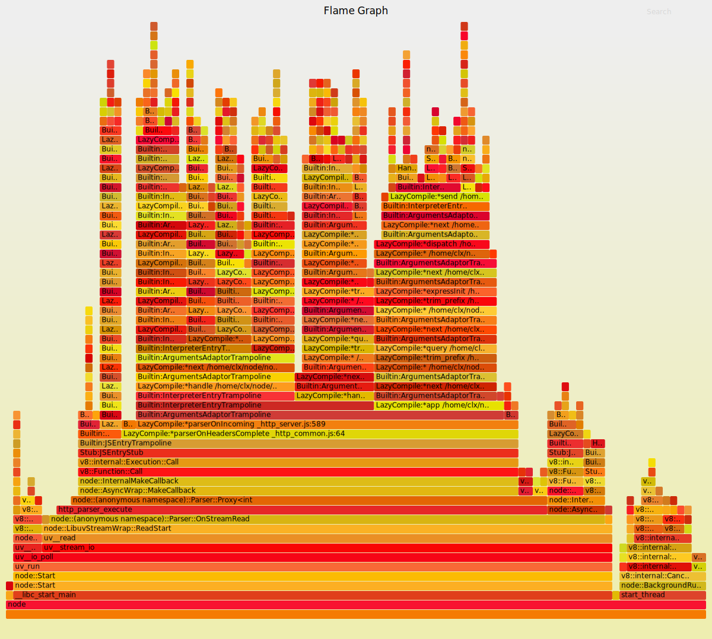

# 火焰图

## 火焰图生成工具

 * 使用 github 上 Flame Graph 工程生成(https://github.com/brendangregg/FlameGraph)
 * pref 命令是 linux 系统提供的原生性能分析工具，会返回 cpu 正在执行的函数以及调用栈

### centos 上生成 node 进程火焰图

```sh
#!/bin/bash
perf record -F 99 -p `pgrep -n node` -g -- sleep 30 # -F 表示瓶绿，每秒99次，-p 表示进行号， -g 表示记录调用栈， sleep 表示持续 30 秒

# perf 就生成一个文件文件，使用 `perf report -n --stdio` 可以统计每个栈出现百分比，从高到低
perf script > out.nodestacks01
git clone --depth 1 http://github.com/brendangregg/FlameGraph
cd FlameGraph
./stackcollapse-perf.pl < ../out.nodestacks01 | ./flamegraph.pl > ../out.nodestacks01.svg
```

### 注意

 * node 进程需要有任务执行，即启动后需要有请求调用 node 进程，如果启动,可以使用 ab 工具进行并发请求



上面的火焰图的 node 进程的代码为

```js
var express = require('express');
var app = express();

app.get('/', function (req, res) {
  res.send('Hello World!');
});

var server = app.listen(3000, function () {
  var host = server.address().address;
  var port = server.address().port;

  console.log('Example app listening at http://%s:%s', host, port);
});
```
使用 ab 发起请求，得到了上面的火焰图
```
ab -k -c 10 -n 2000 "http://127.0.0.1:3000/"
```

## 火焰图分析

 * y 轴表示调用栈，每一层一个函数，调用栈越深，火焰图越高，顶部是正在执行的函数，下方都是它的父函数
 * x 轴表示抽样数，如果一个函数在 x 轴占据的宽度约宽，表示被抽到的次数多，即执行的时间长，x 轴不表示时间，是所有的调用栈合并后，按字母顺序排列的
 * 火焰的每一层都后标注函数名，鼠标悬浮时会显示完整的函数名、抽样抽中次数、占据总抽样次数的百分比
 * 在某一层点击，火焰图会水平放大，显示详细信息