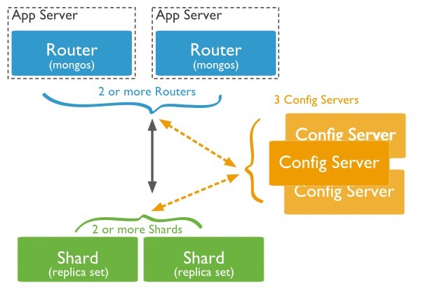

在Mongodb里面存在另一种集群，就是分片技术,可以满足MongoDB数据量大量增长的需求。
当MongoDB存储海量的数据时，一台机器可能不足以存储数据，也可能不足以提供可接受的读写吞吐量。这时，我们就可以通过在多台机器上分割数据，使得数据库系统能存储和处理更多的数据。

分片是一种跨多台机器分发数据的方法。 MongoDB使用分片来支持具有非常大的数据集和高吞吐量操作的部署。
具有大型数据集或高吞吐量应用程序的数据库系统可能会挑战单个服务器的容量。例如，高查询率会耗尽服务器的CPU容量。工作集大小大于系统的RAM会强调磁盘驱动器的I / O容量。

解决系统增长的方法有两种：垂直和水平缩放。

垂直扩展涉及增加单个服务器的容量，例如使用更强大的CPU，添加更多RAM或增加存储空间量。可用技术的局限性可能会限制单个机器对于给定工作负载而言足够强大。此外，基于云的提供商基于可用的硬件配置具有硬性上限。结果，垂直缩放有实际的最大值。

水平扩展涉及划分系统数据集并加载多个服务器，添加其他服务器以根据需要增加容量。虽然单个机器的总体速度或容量可能不高，但每台机器处理整个工作负载的子集，可能提供比单个高速大容量服务器更高的效率。扩展部署容量只需要根据需要添加额外的服务器，这可能比单个机器的高端硬件的总体成本更低。权衡是基础架构和部署维护的复杂性增加。
MongoDB支持通过分片进行水平扩展。

MongoDB 的分片是文档级别的分片，分发文档数据到集群中不同的片上。

### 为什么使用分片
- 复制所有的写入操作到主节点
- 延迟的敏感数据会在主节点查询
- 单个副本集限制在12个节点
- 当请求量巨大时会出现内存不足。
- 本地磁盘不足
- 垂直扩展价格昂贵

### MongoDB分片
下图展示了在MongoDB中使用分片集群结构分布：

上图中主要有如下所述三个主要组件：
## Shard:
用于存储实际的数据块，实际生产环境中一个shard server角色可由几台机器组个一个replica set承担，防止主机单点故障
## Config Server:
mongod实例，存储了整个 ClusterMetadata，其中包括 chunk信息。
## Query Routers:
前端路由，客户端由此接入，且让整个集群看上去像单一数据库，前端应用可以透明使用。
