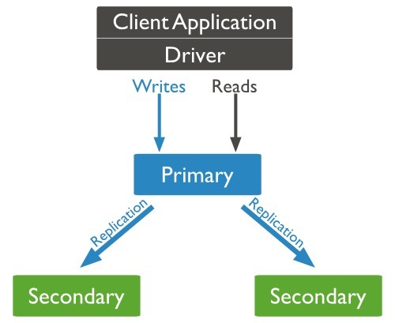

mongodb的复制至少需要两个节点。其中一个是主节点，负责处理客户端请求，其余的都是从节点，负责复制主节点上的数据。

mongodb各个节点常见的搭配方式为：一主一从、一主多从。

主节点记录在其上的所有操作oplog，从节点定期轮询主节点获取这些操作，然后对自己的数据副本执行这些操作，从而保证从节点的数据与主节点一致。

MongoDB复制结构图如下所示：


以上结构图中，客户端从主节点读取数据，在客户端写入数据到主节点时， 主节点与从节点进行数据交互保障数据的一致性。

 副本集特征：
* N 个节点的集群
* 任何节点可作为主节点
* 所有写入操作都在主节点上
* 自动故障转移
* 自动恢复

## 副本集复制实例
以副本集启动一个mongo
```sh
docker run --name mongo_m -p 30001:27017 -d mongo:4 --replSet rs0 --bind_ip_all
docker run --name mongo_s1 -p 30002:27017 -d mongo:4 --replSet rs0 --bind_ip_all
docker run --name mongo_s2 -p 30003:27017 -d mongo:4 --replSet rs0 --bind_ip_all
```
进入任意一个 mongo 实例的 shell，设置配置项：
```json
config={
"_id": "rs0",
"members": [
    {
        "_id": 0,
        "host": "172.17.0.3:27017"
    },
    {
        "_id": 1,
        "host": "172.17.0.4:27017"
    },
    {
        "_id": 2,
        "host": "172.17.0.5:27017"
    }
    ]
}
```
#### 初始化集群
```mongoshell
rs.initiate(config)
```
#### 其它设置: 下面设置副本集延迟时间为 1s
具体其它配置参考官网:https://docs.mongodb.com/manual/replication/
```mongoshell
cfg=rs.conf()
cfg.members[0].slaveDelay = 1
rs.reconfig(cfg)
```
### 在 primary 上插入数据可以在 secondary 上查看，数据已经备份
