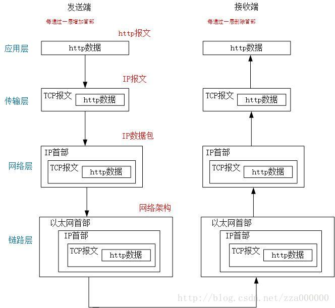

#一次完整的 http 请求

## 一些基本概念

1.TCP/IP: 把与互联网相关联的协议集合起来的总称
2.HTTP 是 TCP/IP 的一个子集
3.TCP/IP 分为四层

- 应用层： HTTP、FTP、DNS 服务
- 传输层： TCP、UPD
- 网络层： 处理网络上流动的数据包，数据包是网络传输的最小数据单位
- 链路层(数据链路层、网络链路层)： 处理连接网络的硬件部分

## 一次完整的 HTTP 请求流程

**1.客户端通过 DNS 服务得到目标 IP**
**2.HTTP 协议：生成针对目标 web 服务器的 HTTP 请求**
**3.TCP 协议：将 HTTP 请求报文分割成报文段，按序号分为多个报文段，把每个报文段可靠的传给对方**
**4.IP 协议：搜索对方地址一边中转一边传送**
**5.服务器 TCP 协议：将接受到的报文按顺序组成报文**
**6.服务器 HTTP 协议：对 web 服务器请求的内容进行处理**

#### 看下图

## http1.0、http1.1、http2.0

| 版本 | 出现时间 | 特点 | 缺点 | 优点 |
| ---- | -------- | ---- | ---- | ---- |
|http1.0|1996|不支持长连接   无状态、无连接|   无法复用连接||
|http1.1|1999|支持长连接(keep-alive)   支持管道复用|不能并行请求    支持缓存(cache-control)、断点传输、Host字段(一个服务器能能够创建多个连接)||
|http2.0|2015|二进制分帧层|||

### Http 2.0

 * http 2.0 在应用层与传输层之间增加一个二进制分帧层，在二进制分帧层上，http 2.0将所有的传输的信息分割为更小的消息个帧，并使用二进制格式对其进行编码，http1.x 的信息会被封装到 headers 里面，body 会被封装到 data 帧里面
 * http 2.0 所有的通信都在一个连接上完成，这个连接可以承载任意数量的双向数据流，每个数据流以消息的形式发送，每个消息包含一个或多个帧，帧是最小的通信单位，每个消息的帧可以乱序发送，接受方会根据帧的首部的流标识符重新组装，生成数据
 * http 2.0 在一个 TCP 连接上实现并行双向数据流通信
 * http 2.0 可以为每个数据流设置优先级和依赖，优先级高的数据流会被服务器优先处理和返回给客户端，数据流还可以依赖其他的子数据流
 * http 2.0 只是对 http1.x 的并行请求进行了优化，同时对头部数据进行压缩，采用二进制分帧进行处理