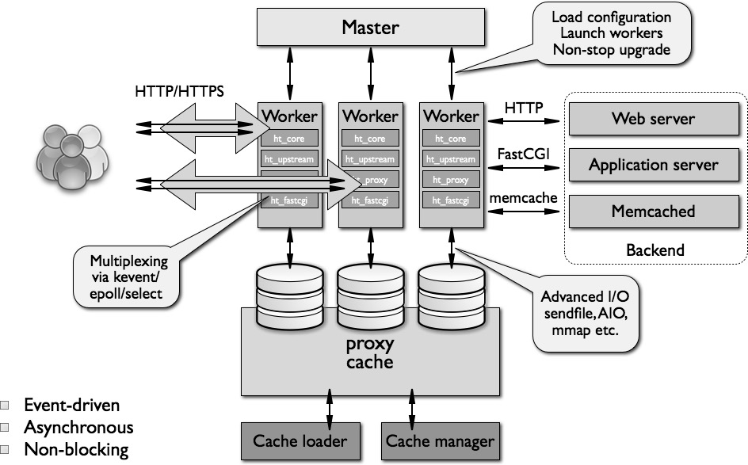
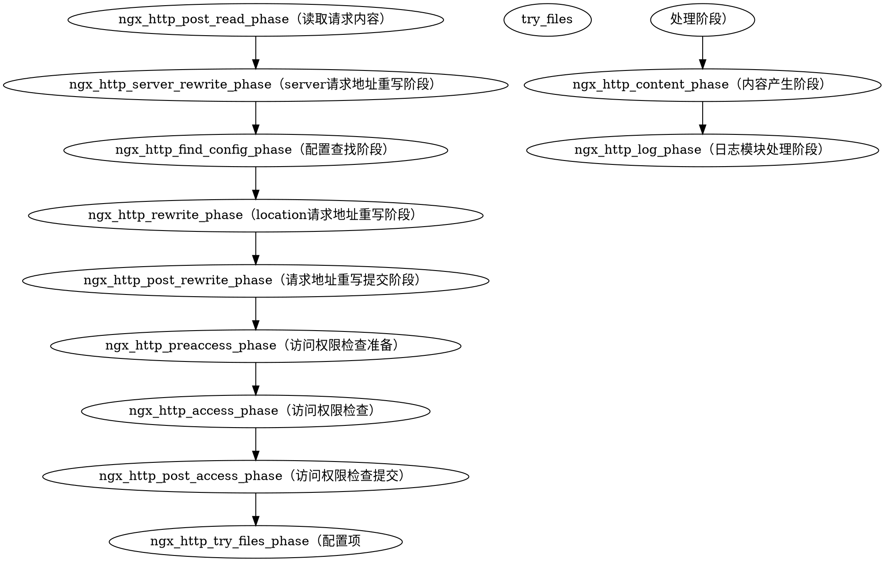

<!-- TOC -->autoauto
- [Nginx 基础架构](#nginx-%E5%9F%BA%E7%A1%80%E6%9E%B6%E6%9E%84)
    - [code 结构](#code-%E7%BB%93%E6%9E%84)
    - [nginx 结构图](#nginx-%E7%BB%93%E6%9E%84%E5%9B%BE)
    - [nginx worker 进程的工作模式](#nginx-worker-%E8%BF%9B%E7%A8%8B%E7%9A%84%E5%B7%A5%E4%BD%9C%E6%A8%A1%E5%BC%8F)
- [Nginx HTTP 处理流程](#nginx-http-%E5%A4%84%E7%90%86%E6%B5%81%E7%A8%8B)

# Nginx 基础架构

## code 结构
ngxin 的 worker 进程代码包括核心模块和功能模块，核心模块维护一个高可用的的执行循环，并在请求的每个阶段执行模块代码的相对应部分；大部分的显示层和应用层功能由不用的功能模块来完成，模块读取和执行网络操作等。

nginx 的模块化架构通常允许开发任务扩展 web 服务器功能集而无需修改 nginx 核心，nginx 模块的版本略有不同，ngxin 目前不支持动态加载模块，即模块需要在编译阶段与核心一起编译。

性能：
 - 网络性能：在不同的负载下，web 服务在网络通信上的吞吐量
 - 单次请求的延迟性
 - 网络效率

## nginx 结构图
nginx 结构图如下:

## nginx worker 进程的工作模式
nginx 不会为每个连接生成进程或线程，而是工作进程接受来自于监听的 socket 的请求，并且通过在每一进程内执行的高效事件循环来处理 worker 进程接收到的请求。主要的工作通过操作系统的内核来实现，当 nginx 进程启动时，worker 进程在处理 http 请求时不断接受、读取和写入套接字。

# Nginx HTTP 处理流程
