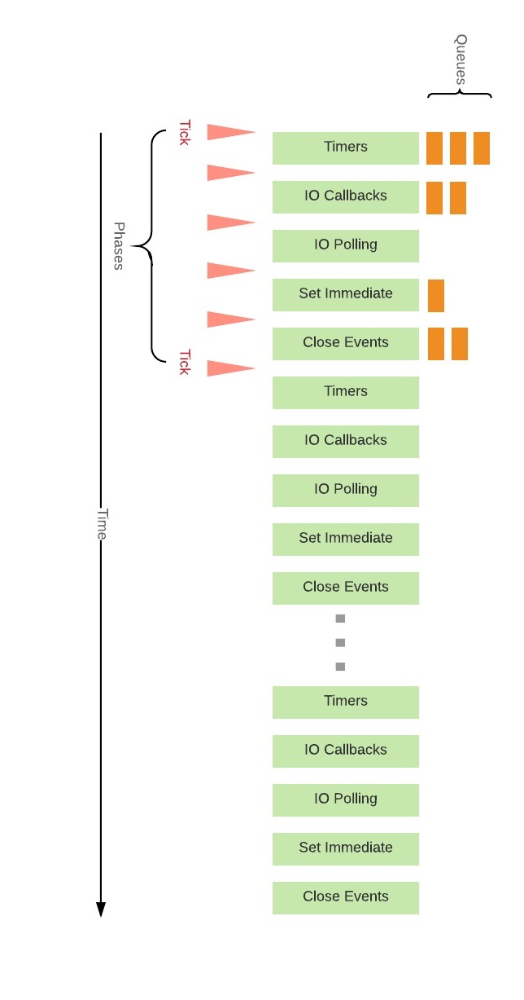
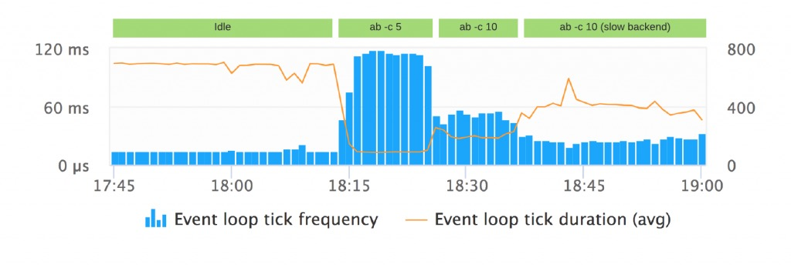
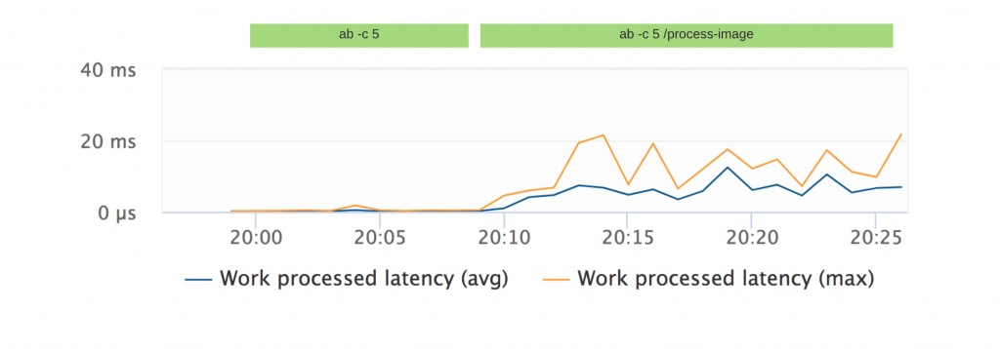

# 深入理解 Node.js 事件循环

---
原文地址:https://medium.com/the-node-js-collection/what-you-should-know-to-really-understand-the-node-js-event-loop-and-its-metrics-c4907b19da4c

Node.js 是一个基于事件的平台，这意味着在 Node.js 中发生的每一件事都是一个事件，传递给 Node.js 的事务将进入 Node.js 的事件循环。

Node.js 的事件循环机制由一个 名为 libuv 的库来提供，这个库位于 Node.js 的底层，并且不能被开发者操作。

事件循环可能是 Node.js 中最容易被误解的概念。

我在一家名为 Dynatrace 的性能监控公司工作，当我们接触事件循环这个主题时，我们付出了很多努力来弄清楚这个概念。

本文中，我将介绍关于事件循环如何工作以及如何正确的管理它。

## 常见误解

Libuv 是一个事件循环库，它为 Node.js 提供了时间循环支持。在一个名为 `Node Interactive Bert Belder`的主题演讲中， libuv 背后的关键任务之一，首先展示了一个 Google 图像搜索，搜索结果中的图片展示了人们对事件循环的各种理解（注：图片应该是人们对事件循环理解所画出的理解图），它们中的大部分都是错误的。

### 误解1:时间循环与我们的代码不在同一个线程中运行

**误解：**
有一个主线程运行用户的 JavaScript 代码，另一个线程运行事件循环，当每次发生异步操作时，主线程将工作移交给事件循环线程，一旦事件循环线程完成，事件循环将通知主线程执行回调。

**正解：**
在 Node.js 中只有一个线程，该线程执行 JavaScript 代码，同时也是运行事件循环的线程，回调的执行（？？？？）由事件循环完成，后面将深入介绍。

### 误解2:所有的异步处理都由线程池完成

**误解：**
异步操作（如文件处理、HTTP请求、数据库操作）始终加载到 libuv 提供的线程池中。

**正解：**
默认情况下，Libuv 会创建一个包含四个线程的线程池，用户与卸载异步工作。现在的操作系统已经为许多 I/O 任务提供戒异步接口。只要有可能，libuv 将优先使用操作系统的这些接口，而不是线程池的线程。这同样适用于像数据库样的第三方子系统，在这里，驱动的作者宁愿使用异步接口而不是使用线程池，简而言之，只有在没有其它方法的情况下，线程池才会使用异步 I/O。

### 误解3: 事件循环类似昱队列或堆栈

**误解：**
事件循环连续遍历异步任务的 FIFO，并在任务完成时执行回调。

**正解：**
虽然类似于队列的接口，但事件循环不会和处理堆栈，事件循环作为一个进程，是一组阶段，它以循环的方式处理特定的任务。

## 理解事件循环阶段

要真正理解事件循环，我们必须了解在哪个阶段完成了哪些事，下图显示了事件循环的各个阶段和时钟:

下面我们开始讨论这些阶段。深入的介绍可以查看 Node.js 官网中的[事件循环](https://nodejs.org/en/docs/guides/event-loop-timers-and-nexttick/)。

### 时钟
每一件事通过 setTimeout() 或 setInterval() 来调度的事件将会在这个阶段被处理。

### IO 回调
大部分回调将会在这个阶段被处理。由于 Node.js 中的所有用户态代码基本上都在回调中，因此这个阶段通常执行用户态代码。

### IO 轮询
执行 IO 轮询去发现需要被处理的新事件，新的事件将会在下次循环时执行。

### Set Immediate
运行通过 setImmediate() 注册的所有回调。

### 关闭
所有的`close`事件回调被执行。

## 事件循环监控
我们可以发现，事实上 Node 应用程序中发生的所有事件都会会在事件循环中运行，这意味着我们能从事件循环中获取相关指标，它们应该能为我们提供有关应用程序的整体运行状况和性能的有价值信息。没有 API 能够从事件循环中获取运行时的指标标准，因此每个监控工具都提供了自己的度量标准。

### 运转频率
每秒运转的次数

### 运转周期
一次运转所花费的时间

### 运转频率和运转时间指标

当我们在不同负载下进行第一次测试时，结果令人惊讶，看下面的例子。

在下面的场景中使用一个 express.js 应用去调用另一个 http 服务器。

有下面四种情景:

1. 没有请求
服务器没有请求

2. ab -c 5
每秒 5 次的并发请求

3. ac -c 10
每秒 10 次的并发请求

4. ab -c 10(慢后端)
被调用的服务器在 1s 后返回数据以模拟慢后端。这回导致一些叫做背压的事情，因为请求等待在 Node 内部堆积。

从上面的结果我们能够发现一个现象：时间循环执行的频率和时长被动态的更新。

如果应用是闲置的，意味着没有任何挂起任务（时钟、回调等），事件循环阶段全速运行没有任何意义，因此事件循环将适应并在轮询阶段阻塞一段时间等待新的外部事件注入。

这意味着，无负载下的指标与和在高负载下的慢后端（低频率、高负载）指标是类型的。

我们还发现，示例程序在具有 5 个并发请求时性能最好。

虽然这些数据为我们提供了一些有价值的见解，但我们仍然不知道时间花在哪个节点，因此我们进一步研究并提出了另外两个指标。

### 处理延迟

这个指标衡量线程池处理异步任务所需的时间。

高工作处理延迟表示繁忙/耗尽的线程池。

为了测试这个指标，我创建了一个使用名为 Sharp 的模块处理图像的快速路由。由于图像处理很昂贵，Sharp 利用线程池来实现这一点。
