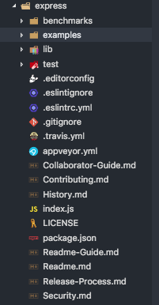

# Node.js Web 框架 Express 源码分析

- version: 4.16.3

---

## Express 简介

Express 是一个基于 Node.js 平台的快速、开放发、极简的 Web 框架。Express 是一个保持最小规模的灵活的 Node.js Web 应用程序开发框架，为 Web 和移动应用程序提供了一组强大的功能。

## 目录说明

从 github 上拉取代码并使用 vscode 打开

```sh
git clone https://github.com/expressjs/express.git
cd express
code .
```

Express 目录文件如下图:

下面对目录中主要文件进行一下说明:

- benchmarks - 基准测试代码
- examples - 实例文件
- lib - 源文件
- test - 单元测试代码
- index.js - 入口文件
- package.json - 工程说明文件

## package.json 文件介绍

npm 库中的模块都会存在一个 package.json 文件，用来对模块进行说明，让使用模块的人知道该模块的基本信息，同时使用 npm 安装该模块时，会将 package.json 文件中标注的依赖模块也进行安装，使用使用该模块时更加简便， 因此我们在使用一个 Node.js 中的模块时首先应该查看其 package.json 文件。我们编写模块时可以手动创建 package.json 文件，也可以使用`npm init`命令进行创建。Express 4.16.3 的 package.json 文件如下，下面对 package.json 文件中主要信息进行说明:

```json
{
  "name": "express", // 模块名称
  "description": "Fast, unopinionated, minimalist web framework", // 模块描述
  "version": "4.16.3", //版本号
  "author": "TJ Holowaychuk <tj@vision-media.ca>", // 作者
  "contributors": [
    // 其他贡献者
    "Aaron Heckmann <aaron.heckmann+github@gmail.com>",
    "Ciaran Jessup <ciaranj@gmail.com>",
    "Douglas Christopher Wilson <doug@somethingdoug.com>",
    "Guillermo Rauch <rauchg@gmail.com>",
    "Jonathan Ong <me@jongleberry.com>",
    "Roman Shtylman <shtylman+expressjs@gmail.com>",
    "Young Jae Sim <hanul@hanul.me>"
  ],
  "license": "MIT", // 使用的证书
  "repository": "expressjs/express", // 仓库名称
  "homepage": "http://expressjs.com/", // 介绍主页
  "keywords": [
    // 关键字
    "express",
    "framework",
    "sinatra",
    "web",
    "rest",
    "restful",
    "router",
    "app",
    "api"
  ],
  "dependencies": {
    // 使用时依赖魔窟
    "accepts": "~1.3.5",
    "array-flatten": "1.1.1",
    "body-parser": "1.18.2",
    "content-disposition": "0.5.2",
    "content-type": "~1.0.4",
    "cookie": "0.3.1",
    "cookie-signature": "1.0.6",
    "debug": "2.6.9",
    "depd": "~1.1.2",
    "encodeurl": "~1.0.2",
    "escape-html": "~1.0.3",
    "etag": "~1.8.1",
    "finalhandler": "1.1.1",
    "fresh": "0.5.2",
    "merge-descriptors": "1.0.1",
    "methods": "~1.1.2",
    "on-finished": "~2.3.0",
    "parseurl": "~1.3.2",
    "path-to-regexp": "0.1.7",
    "proxy-addr": "~2.0.3",
    "qs": "6.5.1",
    "range-parser": "~1.2.0",
    "safe-buffer": "5.1.1",
    "send": "0.16.2",
    "serve-static": "1.13.2",
    "setprototypeof": "1.1.0",
    "statuses": "~1.4.0",
    "type-is": "~1.6.16",
    "utils-merge": "1.0.1",
    "vary": "~1.1.2"
  },
  "devDependencies": {
    // 开发时依赖模块
    "after": "0.8.2",
    "cookie-parser": "~1.4.3",
    "cookie-session": "1.3.2",
    "ejs": "2.5.7",
    "eslint": "2.13.1",
    "express-session": "1.15.6",
    "hbs": "4.0.1",
    "istanbul": "0.4.5",
    "marked": "0.3.17",
    "method-override": "2.3.10",
    "mocha": "3.5.3",
    "morgan": "1.9.0",
    "multiparty": "4.1.3",
    "pbkdf2-password": "1.2.1",
    "should": "13.2.1",
    "supertest": "1.2.0",
    "connect-redis": "~2.4.1",
    "vhost": "~3.0.2"
  },
  "engines": {
    // node 版本要求
    "node": ">= 0.10.0"
  },
  "files": [
    // 当模块作为依赖被安装时，包含下面文件
    "LICENSE",
    "History.md",
    "Readme.md",
    "index.js",
    "lib/"
  ],
  "scripts": {
    // 脚本命令
    "lint": "eslint .",
    "test": "mocha --require test/support/env --reporter spec --bail --check-leaks --no-exit test/ test/acceptance/",
    "test-ci": "istanbul cover node_modules/mocha/bin/_mocha --report lcovonly -- --require test/support/env --reporter spec --check-leaks --no-exit test/ test/acceptance/",
    "test-cov": "istanbul cover node_modules/mocha/bin/_mocha -- --require test/support/env --reporter dot --check-leaks --no-exit test/ test/acceptance/",
    "test-tap": "mocha --require test/support/env --reporter tap --check-leaks --no-exit test/ test/acceptance/"
  }
}
```

## 入口文件 - index.js

通过 Express 的 package.json 文件我们发现并没有 main 字段来指定入口文件，那我们怎么判断入口文件为 index.js 文件呢？在我们 require 一个模块或文件时，首先会通过 package.json 文件的 main 字段来寻找入口文件，如果没有 main 字段，那么会将文件目录下的 index.js 文件作为使用文件，所以我们可以判断 index.js 文件时入口文件.

打开 index.js 文件，内容如下:

```js
"use strict";

module.exports = require("./lib/express");
```

index.js 文件并没有编写任何逻辑，只是将 lib 目录下的 express.js 文件暴露出来。

打开 lib/express.js 文件，内容如下:

```js
"use strict";

/**
 * Module dependencies.
 */

var bodyParser = require("body-parser");
var EventEmitter = require("events").EventEmitter;
var mixin = require("merge-descriptors");
var proto = require("./application");
var Route = require("./router/route");
var Router = require("./router");
var req = require("./request");
var res = require("./response");

/**
 * Expose `createApplication()`.
 */

exports = module.exports = createApplication; // 暴露 createApplication，是一个函数，koa 暴露的是一个 class

/**
 * Create an express application.
 *
 * @return {Function}
 * @api public
 */

function createApplication() {
  var app = function(req, res, next) {
    app.handle(req, res, next);
  };

  mixin(app, EventEmitter.prototype, false);
  mixin(app, proto, false);

  // expose the prototype that will get set on requests
  app.request = Object.create(req, {
    app: { configurable: true, enumerable: true, writable: true, value: app }
  });

  // expose the prototype that will get set on responses
  app.response = Object.create(res, {
    app: { configurable: true, enumerable: true, writable: true, value: app }
  });

  app.init();
  return app;
}

/**
 * Expose the prototypes.
 */

exports.application = proto;
exports.request = req;
exports.response = res;

/**
 * Expose constructors.
 */

exports.Route = Route;
exports.Router = Router;

/**
 * Expose middleware
 */

exports.json = bodyParser.json;
exports.query = require("./middleware/query");
exports.static = require("serve-static");
exports.urlencoded = bodyParser.urlencoded;

/**
 * Replace removed middleware with an appropriate error message.
 */
[
  "bodyParser",
  "compress",
  "cookieSession",
  "session",
  "logger",
  "cookieParser",
  "favicon",
  "responseTime",
  "errorHandler",
  "timeout",
  "methodOverride",
  "vhost",
  "csrf",
  "directory",
  "limit",
  "multipart",
  "staticCache"
].forEach(function(name) {
  Object.defineProperty(exports, name, {
    get: function() {
      throw new Error(
        "Most middleware (like " +
          name +
          ") is no longer bundled with Express and must be installed separately. Please see https://github.com/senchalabs/connect#middleware."
      );
    },
    configurable: true
  });
});
```

从上面的代码中可以看到，整个 Express 暴露出去的是一个名叫`createApplication`的 function，所以使用 Express 时是`app=express()`；而 Koa 暴露出去的是一个 Class，使用时是`app= new Koa()`.

`createApplication`函数定一个名为`app`的函数，该函数执行一个`handler`的方法，然后将`EventEmitter`的原型和`application`文件中 app 没有的属性挂载给`app`变量；最后  将`request`、`response`文件内容挂载到`app`变量上。

`express.js`文件本身还将`application`、`request`、`response`、`Route`、`Router`对象暴露出去，使得使用者可以直接使用  这些对象 。同时，Express 还内置了四个中间件，也将其暴露出来，并对去掉了 Express 3.X 中的一些中间件，使用去掉的中间件时会给出错误提示。

执行初始化方法`init`，然后  返回 app 对象。从`createApplication`函数中我们看到其中调用了`handle`和`init` 属性方法，而这两个属性方法并未出现  在`express.js`文件中，所以推测这两个属性方法应该是在`proto`(即 application.js)文件中，因为`createApplication`方法中使用了`mix`来将 EventEmitter 的原型属性  和 application.js 文件中的对象 merge  给 app 对象。下面我们追寻 application.js 文件。

## 应用文件 - application.js

application.js 文件主要代码如下:

```js
// require some denpendencies

var app = exports = module.exports = {};

var trustProxyDefaultSymbol = '@@symbol:trust_proxy_default';

app.init = function init() {
  this.cache = {};
  this.engines = {};
  this.settings = {};

  this.defaultConfiguration();
};

app.defaultConfiguration = function defaultConfiguration() {

};

app.handle = function handle(req, res, callback) {
};
...
```
从上面代码我们看到，application 文件暴露出来的是一个对象，这个对象中有很多方法，这些方法都被挂载到`express.js`文件中的`createApplication`函数中创建的变量`app`上面，在这个方法中，我们发现了在 `express.js`中出现过的`init`和`handle`方法。我们跟着代码执行的逻辑，先看一下`init`方法，`init`方法中设置了三个变量，分别用来存储缓存、摸版引擎、相关设置，然后执行`defaultConfiguration`方法，在，查看`defaultConfiguration`方法前，我们先看一下`set`和`enable`方法，代码如下:
```js
// ------------- set function ------------
app.set = function set(setting, val) {
  if (arguments.length === 1) {
    // app.get(setting)
    return this.settings[setting];
  }

  debug('set "%s" to %o', setting, val);

  // set value
  this.settings[setting] = val;

  // trigger matched settings
  switch (setting) {
    case 'etag':
      this.set('etag fn', compileETag(val));
      break;
    case 'query parser':
      this.set('query parser fn', compileQueryParser(val));
      break;
    case 'trust proxy':
      this.set('trust proxy fn', compileTrust(val));

      // trust proxy inherit back-compat
      Object.defineProperty(this.settings, trustProxyDefaultSymbol, {
        configurable: true,
        value: false
      });

      break;
  }

  return this;
};

// -------------enable function ----------
app.enabled = function enabled(setting) {
  return Boolean(this.set(setting));
};
```
我们可以看到，`set`方法用于将一对键值存储到 app 对象的 settings 变量中，如果键为`etag`、`query parser`、`trust proxy`中任何一个，则将其值进行编译后进行存储，对于`trust proxy`键，还需要添加`trustProxyDefaultSymbol`键值。
下面我们来看`defaultConfiguration`方法:
```js
app.defaultConfiguration = function defaultConfiguration() {
  var env = process.env.NODE_ENV || 'development';

  // default settings
  this.enable('x-powered-by');
  this.set('etag', 'weak');
  this.set('env', env);
  this.set('query parser', 'extended');
  this.set('subdomain offset', 2);
  this.set('trust proxy', false);

  // trust proxy inherit back-compat
  Object.defineProperty(this.settings, trustProxyDefaultSymbol, {
    configurable: true,
    value: true
  });

  debug('booting in %s mode', env);

  this.on('mount', function onmount(parent) {
    // inherit trust proxy
    if (this.settings[trustProxyDefaultSymbol] === true
      && typeof parent.settings['trust proxy fn'] === 'function') {
      delete this.settings['trust proxy'];
      delete this.settings['trust proxy fn'];
    }

    // inherit protos
    setPrototypeOf(this.request, parent.request)
    setPrototypeOf(this.response, parent.response)
    setPrototypeOf(this.engines, parent.engines)
    setPrototypeOf(this.settings, parent.settings)
  });

  // setup locals
  this.locals = Object.create(null);

  // top-most app is mounted at /
  this.mountpath = '/';

  // default locals
  this.locals.settings = this.settings;

  // default configuration
  this.set('view', View);
  this.set('views', resolve('views'));
  this.set('jsonp callback name', 'callback');

  if (env === 'production') {
    this.enable('view cache');
  }

  Object.defineProperty(this, 'router', {
    get: function() {
      throw new Error('\'app.router\' is deprecated!\nPlease see the 3.x to 4.x migration guide for details on how to update your app.');
    }
  });
};
```