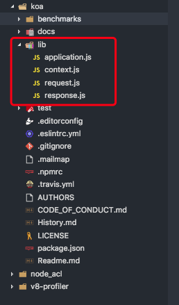
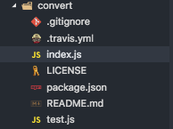
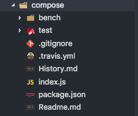
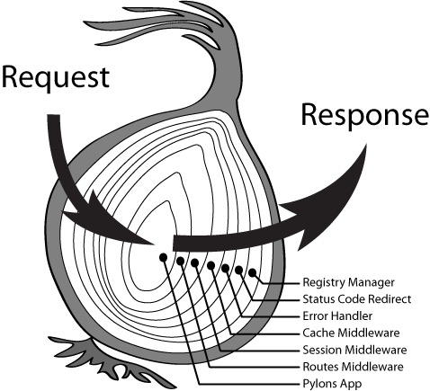

# Node.js Web 框架 Koa 源码分析

- version: 2.5.2

---

## koa 介绍

Koa 是一个流行的 Web 框架，由 Express 原班人马打造，致力于称为 web 应用和 API 领域中的一个更小、更富有表现力、更健壮的基石。利用 async/await  函数来处理异步操作，使用代码更加优雅，并有力的增强了错误处理，Koa 并没有捆绑任何中间间，而是提供了一套优雅的方法，让使用者快速而预约地编写服务端应用程序。

## 目录说明

从 github 上拉取代码并使用 vscode 打开

```sh
git clone https://github.com/koajs/koa.git
cd koa
code .
```

打开后目录如下图:

下面对该文件中  主要目录进行基本介绍:

- package.json - 项目说明文件
- tarvis.yaml - CI 文件
- test 目录 - 单元测试代码
- docs - 文件
- benchmarks 基准测试代码
- lib - 源码文件
  - application.js - 入口文件（从 package.json 文件的 main 字段得知）
  - request.js - 请求处理
  - response - 相应处理
  - context - 上下文处理

## package.json 文件介绍

在 JS 中，规范的框架和库都会在根目录中包含一个 package.json 文件，这个  文件  是对该工程的一个说明，包括版本，基本  使用等；同时也是 npm 官方推荐需要编写的文件，通过该文件可以更好的在 npm 上安装使用 npm 包， 因此在研究一个工程的源码时，应该首先查看其 package.json 文件。koa 2.5.2 的 package.json 文件如下，下面对 package.json 文件的关键字段进行说明。

```json
{
  "name": "koa", // 工程名称
  "version": "2.5.2", // 版本号
  "description": "Koa web app framework", // 工程描述
  "main": "lib/application.js", // 入口文件
  "scripts": {
    // 主要命令
    "test": "jest",
    "test-cov": "jest --coverage --runInBand --forceExit",
    "lint": "eslint benchmarks lib test",
    "bench": "make -C benchmarks",
    "authors": "git log --format='%aN <%aE>' | sort -u > AUTHORS"
  },
  "repository": "koajs/koa",
  "keywords": [
    // 工程关键字
    "web",
    "app",
    "http",
    "application",
    "framework",
    "middleware",
    "rack"
  ],
  "license": "MIT", // 遵循的证书标准
  "dependencies": {
    "accepts": "^1.3.5", // 运行时的外部依赖
    "cache-content-type": "^1.0.0",
    "content-disposition": "~0.5.2",
    "content-type": "^1.0.4",
    "cookies": "~0.7.1",
    "debug": "^3.1.0",
    "delegates": "^1.0.0",
    "depd": "^1.1.2",
    "destroy": "^1.0.4",
    "error-inject": "^1.0.0",
    "escape-html": "^1.0.3",
    "fresh": "~0.5.2",
    "http-assert": "^1.3.0",
    "http-errors": "^1.6.3",
    "is-generator-function": "^1.0.7",
    "koa-compose": "^4.1.0",
    "koa-convert": "^1.2.0",
    "koa-is-json": "^1.0.0",
    "on-finished": "^2.3.0",
    "only": "~0.0.2",
    "parseurl": "^1.3.2",
    "statuses": "^1.5.0",
    "type-is": "^1.6.16",
    "vary": "^1.1.2"
  },
  "devDependencies": {
    // 调试时的外部依赖
    "eslint": "^3.17.1",
    "eslint-config-koa": "^2.0.0",
    "eslint-config-standard": "^7.0.1",
    "eslint-plugin-promise": "^3.5.0",
    "eslint-plugin-standard": "^2.1.1",
    "jest": "^20.0.0",
    "supertest": "^3.1.0"
  },
  "engines": {
    // 指定 node 版本，也可以指定 npm 版本
    "node": "^4.8.4 || ^6.10.1 || ^7.10.1 || >= 8.1.4"
  },
  "files": ["lib"],
  "jest": {
    "testMatch": ["**/test/!(helpers)/*.js"],
    "coverageReporters": ["text-summary", "lcov"],
    "bail": true,
    "testEnvironment": "node"
  }
}
```

## 入口文件 - application.js

application.js 文件 主要内容如下

```js
// require some denpendencies
const Emitter = require('events');
const response = require('./response');
const context = require('./context');
const request = require('./request');
const util = require('util');

module.export = class Application extends Emitter {
  constructor() {
      super();

      this.proxy = false;               // 默认不解析代理的头部字段
      this.middleware = [];             // 初始化中间价数组
      this.subdomainOffset = 2;         // 设置子域获取部分
      this.env = process.env.NODE_ENV || 'development'; // 默认为生产环境
      this.context = Object.create(context);
      this.request = Object.create(request);
      this.response = Object.create(response);
      if (util.inspect.custom) {
          this[util.inpsect.custom] = this.inspect;
      }
  }

  listen(){...}
  toJSON(){...}
  inspect(){...}
  use(){...}
  callback(){...}
  handleRequest(){...}
  createContext(){...}
  onerror(){...}
};
```

从上面的代码中可以看到，Koa 为实例对象设置  了七个属性和八个方法，同时应用集成 Node.js 的 Emitter 模块.

下面首先对上面的七个属性和八个方法分别进行说明，再  说明为什么要继承 Emitter 模块.

### 实例属性说明

- proxy - 使用 request 的 header 方法获取请求头部信息时默认不解析代理的头部字段.
- middleware - 初始化中间间数组.
- subdomainOffset - 设置子域获取为主域之前的两位，也可以理解为设置  从主域位数。子域时应用程序主域之前主机的点分割部分，默认情况下,对于域名"tobi.ferrets.example.com",request.subdimain 返回["ferrets","tobi"],当设置 subdomainOffset 为 3 时，返回结果为 ["tobi"].
- env - 设置默认使用环境为开发环境
- context - 将 context 文件返回的对象挂载到该属性上，便于后期使用其方法.
- request - 将 request 文件返回的对象挂载到该属性上，便于后期使用其方法.
- response - 将 reponse 文件返回的对象挂载到该属性上，便于后期使用其方法.

### 实例方法说明

1. listen

listen 函数代码如下:

```js
listen(...args) {
    debug('listen');
    const server = http.createServer(this.callback());
    return server.listen(...args);
  }
```

listen 方法创建了一个 http 实例，同时返回一个启动的实例，因此调用 Koa 的  listen 方法时，实际上执行的是先创建一个 http 实例，然后在某个端口号启动该 http 实例，==参数为 this.callabck()，即当你调用 koa 实例的 listen 方法时，已经启动了一个 http server，该 http server 的参数为下面的 callback 函数执行返回的结果.==

1. toJSON

toJSON 方法如下:

```js
toJSON() {
    return only(this, [
      'subdomainOffset',
      'proxy',
      'env'
    ]);
  }
```

实例调用该方法时只返回实例的这三个属性.

3. inspect

 检查实例  参数设置情况，返回 toJSON 方法结果.

4. use

use 方法代码如下

```js
use(fn) {
    if (typeof fn !== 'function') throw new TypeError('middleware must be a function!');
    if (isGeneratorFunction(fn)) {
      deprecate('Support for generators will be removed in v3. ' +
                'See the documentation for examples of how to convert old middleware ' +
                'https://github.com/koajs/koa/blob/master/docs/migration.md');
      fn = convert(fn);
    }
    debug('use %s', fn._name || fn.name || '-');
    this.middleware.push(fn);
    return this;
  }
```

use 方法用来将中间件函数存放中间件数组中，如果中间价不是函数则  抛出错误，如果为生成器函数， 通过`koa-convert`模块将其转换为 promise ，koa-convert 在 koa 的 package.json 文件的 dependencies 字段中，安装 koa 时会被自动安装进去.

5. callback

callback 方法代码如下:

```js
callback() {
    const fn = compose(this.middleware);

    if (!this.listenerCount('error')) this.on('error', this.onerror);

    const handleRequest = (req, res) => {
      const ctx = this.createContext(req, res);
      return this.handleRequest(ctx, fn);
    };

    return handleRequest;
  }
```

callback 方式返回函数， 该函数用作于 http.createServer 方法的回调函数，可以看到 callback 返回的函数的参数为 req 和 res，而这个 req 和 res 就是 Node 的 http.createServer 的原生参数，因此又回到了 http 模块，真正的处理函数是 `const ctx = this.createContext(req, res);return this.handleRequest(ctx, fn);`这两行句，==第一句创建上下文，第二句使用中间件对上下文处理。== compose对中间件数组进行处理返回一个 promise.

6. handleRequest

handleRequest 方法代码如下:

```js
handleRequest(ctx, fnMiddleware) {
    const res = ctx.res;
    res.statusCode = 404;
    const onerror = err => ctx.onerror(err);
    const handleResponse = () => respond(ctx);
    onFinished(res, onerror);
    return fnMiddleware(ctx).then(handleResponse).catch(onerror);
  }
```

 该函数用于处理请求，ctx 是请求，fnMiddlewara 是中间价函数，对请求使用中间间，中间件是一个 promise(后面会说到)，==上下文对象作为中间价函数的参数传递给中间价==，中间件对上下文进行处理后没有错误则调用返回函数返回结果，如果 catch 到错误，则调用错误处理函数处理错误.

7. createContext

createContext 代码如下:

```js
createContext(req, res) {
    const context = Object.create(this.context);
    const request = context.request = Object.create(this.request);
    const response = context.response = Object.create(this.response);
    context.app = request.app = response.app = this;
    context.req = request.req = response.req = req;
    context.res = request.res = response.res = res;
    request.ctx = response.ctx = context;
    request.response = response;
    response.request = request;
    context.originalUrl = request.originalUrl = req.url;
    context.state = {};
    return context;
  }
```

该方法主要是  初始化 context，将 app、request、response 等对象挂载到 context 对象上.

8. onerror

onerror 函数代码如下:

```js
onerror(err) {
    if (!(err instanceof Error)) throw new TypeError(util.format('non-error thrown: %j', err));

    if (404 == err.status || err.expose) return;
    if (this.silent) return;

    const msg = err.stack || err.toString();
    console.error();
    console.error(msg.replace(/^/gm, '  '));
    console.error();
  }
```

koa 的默认错误函数.

### 为什么继承自 Emitter(events) 模块

Node.js 是一个基于事件驱动的架构，所有的请求  需要  先进行事件循环，在事件循环中将请求抛给操作系统，因此如果想利用 Node.js 的事件循环来正确处理请求，那么请求就应该是一个 Emitter，所以 koa 需要继承 Emitter.

关于事件循环  相关信息可以查看下面两篇文章.
[EventLoop](../deepingUnderstanding/EventLoop.md)
[events](../deepingUnderstanding/events.md)

## 请求文件 - request.js

请求文件代码结构如下:

```js
// require some dependencies
module.export = {
  get header() {    // 去值
    return this.req.headers;
  },

  set header(val) { // 存值
    this.req.headers = val;
  }

  ...
};
```

从上面代码结构可以看出，request.js 文件返回的是一个对象，该对象是一个一个的`setter`和`getter`方法，`setter`和`getter`是 ES6 中新增的内容，用于对 Class 进行存值(setter)和取值(getter)。例如上面代码中的`get header()`方法，调用该方法时，执行`this.req.headers`，而`this.req`是 http.createServer 原生的 req，所以获取的是 整个响应的信息.

## 响应文件 - response.js

响应文件代码结构如下:

```js
// require some independencies
module.exports = {
  get socket() {
    return this.res.socket;
  },

  get header() {
    const { res } = this;
    return typeof res.getHeaders === 'function'
      ? res.getHeaders()
      : res._headers || {};
  }
  ...
```

响应文件以请求文件很类似，返回的都是一个对象，这个对象里面是一个一个的`setter`和`getter`方法，用户对响应进行处理。，主要的 api 是 http.createServer 原生的 res 的 api.

## 上下文文件 - context.js

上下文文件内容如下:

```js
const delegate = require('delegates');

const proto = module.exports = {
    inspect() {
        if (this = proto) return this;
        return toJSON();
    }
    ...
}

/**
 * Response delegation.
 */

delegate(proto, 'response')
  .method('attachment')
  .method('redirect')
  .method('remove')
  .method('vary')
  .method('set')
  .method('append')
  .method('flushHeaders')
  .access('status')
  .access('message')
  .access('body')
  .access('length')
  .access('type')
  .access('lastModified')
  .access('etag')
  .getter('headerSent')
  .getter('writable');

/**
 * Request delegation.
 */

delegate(proto, 'request')
  .method('acceptsLanguages')
  .method('acceptsEncodings')
  .method('acceptsCharsets')
  .method('accepts')
  .method('get')
  .method('is')
  .access('querystring')
  .access('idempotent')
  .access('socket')
  .access('search')
  .access('method')
  .access('query')
  .access('path')
  .access('url')
  .access('accept')
  .getter('origin')
  .getter('href')
  .getter('subdomains')
  .getter('protocol')
  .getter('host')
  .getter('hostname')
  .getter('URL')
  .getter('header')
  .getter('headers')
  .getter('secure')
  .getter('stale')
  .getter('fresh')
  .getter('ips')
  .getter('ip');
```
从上面代码可以看出，上下文实际上也是返回一个对象，这个对象里面是一个一个的`setter`和`getter`方法，用于对 Application Class 变量进行获取和设置。在文件最后，使用 delegate 模块将 response 各 request 的一下方法委托给上下文 context，这样使得使用 response 和 request 方法时更加方便，使用`ctx.response,body`与使用`ctx.body`是同样的效果.


## 中间件函数转换（koa-convert）

在 application.js 文件中 Application 类中由一个 `use` 方法，用于注册中间价，这个方法会对每个传入的中间价函数进行判断，如果该函数不是一个生成器函数，则使用`convert`将其转换为一个 promise，下面我看一看这个`convert`，从 github 上拉取代码并用编辑器打开.

```sh
# version 1.2.0
git clone https://github.com/koajs/convert.git
cd convert
code .
```
convert 目录结结构如下:

通过 package.json 文件可以得知，主文件为`index.js`，打开`index.js`文件，内容如下:
```js
'use strict'

const co = require('co')
const compose = require('koa-compose')

module.exports = convert

function convert (mw) {
  if (typeof mw !== 'function') {
    throw new TypeError('middleware must be a function')
  }
  if (mw.constructor.name !== 'GeneratorFunction') {
    // assume it's Promise-based middleware
    return mw
  }
  const converted = function (ctx, next) {
    return co.call(ctx, mw.call(ctx, createGenerator(next)))
  }
  converted._name = mw._name || mw.name
  return converted
}

function * createGenerator (next) {
  return yield next()
}

// convert.compose(mw, mw, mw)
// convert.compose([mw, mw, mw])
convert.compose = function (arr) {
  if (!Array.isArray(arr)) {
    arr = Array.from(arguments)
  }
  return compose(arr.map(convert))
}

convert.back = function (mw) {
  if (typeof mw !== 'function') {
    throw new TypeError('middleware must be a function')
  }
  if (mw.constructor.name === 'GeneratorFunction') {
    // assume it's generator middleware
    return mw
  }
  const converted = function * (next) {
    let ctx = this
    let called = false
    // no need try...catch here, it's ok even `mw()` throw exception
    yield Promise.resolve(mw(ctx, function () {
      if (called) {
        // guard against multiple next() calls
        // https://github.com/koajs/compose/blob/4e3e96baf58b817d71bd44a8c0d78bb42623aa95/index.js#L36
        return Promise.reject(new Error('next() called multiple times'))
      }
      called = true
      return co.call(ctx, next)
    }))
  }
  converted._name = mw._name || mw.name
  return converted
}
```
文件导出的是`convert`函数，查看`convert`函数得知，首先会对传入的函数进行判断，如果是一个 GeneratorFunction，则对其进行处理，最后返回的是`co.call(ctx, mw.call(ctx, createGenerator(next)))`，`co`模块用于让 generator 函数自动执行，`convert`使用 co 对 generatorFunction 包裹了一层，使得 generatorFunction 可以不依赖于手动 next 而执行，而由于 co 会返回一个 promise，所有 covert 之后的 generatorFunction 也编程了一个 promise，与其他的中间价函数兼容了.

## 中间件打包（koa-compose）

在 application.js 文件 Application Class 中 callback() 方法使用了 `compose`对中间件数组进行打包，从 github 拉取代码并用编辑器打开.
```sh
# version 4.1.0
git clone https://github.com/koajs/compose.git
cd compose
code .
```
compose 模块目录如下:

通过查看 package.json 文件知道入口文件为 index.js，index.js 文件代码非常简洁，只有一个函数，代码如下:
```js
'use strict'

/**
 * Expose compositor.
 */

module.exports = compose

/**
 * Compose `middleware` returning
 * a fully valid middleware comprised
 * of all those which are passed.
 *
 * @param {Array} middleware
 * @return {Function}
 * @api public
 */

function compose (middleware) {
  if (!Array.isArray(middleware)) throw new TypeError('Middleware stack must be an array!')
  for (const fn of middleware) {
    if (typeof fn !== 'function') throw new TypeError('Middleware must be composed of functions!')
  }

  /**
   * @param {Object} context
   * @return {Promise}
   * @api public
   */

  return function (context, next) {
    // last called middleware #
    let index = -1
    return dispatch(0)
    function dispatch (i) {
      if (i <= index) return Promise.reject(new Error('next() called multiple times'))
      index = i
      let fn = middleware[i]
      if (i === middleware.length) fn = next
      if (!fn) return Promise.resolve()
      try {
        return Promise.resolve(fn(context, dispatch.bind(null, i + 1)));
      } catch (err) {
        return Promise.reject(err)
      }
    }
  }
}
```
compose 模块返回一个匿名函数，整个 koa 正真执行处理的是这个返回的匿名函数，这个匿名函数返回一个 promise 执行后的结果。下面分析这个匿名函数，匿名函数返回`dispatch`函数调用的结果，`dispatch`函数返回一个中间价执行后的 promise，即`return Promise.resolve(fn(context, dispatch.bind(null, i + 1)))`，而这个 promise 会又一个递归的`dispatch`函数调用，因此实际上的执行顺序是下面这样的:
```js
return Promise.reslove(
    ... 
    return Promise.reslove(
        ...
        return Promise.reslove(
            ...
        )
    )
)
```
compose 模块将中间价数组转换为了一个嵌套的 Promise，所有前面说到，如果中间件是一个生成器函数，需要通过 convert 将其转换为一个 promise。所以就有了 koa 中间件的调用是一个洋葱式的说法。koa 中间件调用图示如下:


从 koa 源码设计上得出什么结论，一个框架应该包含  哪几部分，每部分怎样设计
