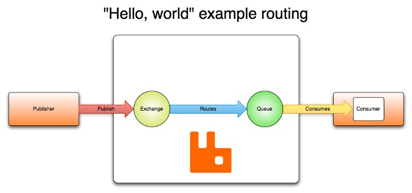

# RabbitMQ

---
RabbitMQ 是一个广泛使用的开源消息代理，支持多种消息传递协议，提供多种语言的开发工具。

## 特性

### 端口说明
 - 4369: node 节点发现和 cli 工具端口号
 - 5672: AMQP 端口号
 - 5671: AMQP TLS 端口号
 - 25672:
 - 15672: HTTP API、Managerment UI、rabbitmqadmin 端口号

### AMQP
AMQP(Advanced Message Queuing Protocol)是一种消息协议，AMQP 0-9-1的工作过程如下图：

消息（message）被发布者（publisher）发送给交换机（exchange），交换机常常被比喻成邮局或者邮箱。然后交换机将收到的消息根据路由规则分发给绑定的队列（queue）。最后AMQP代理会将消息投递给订阅了此队列的消费者，或者消费者按照需求自行获取。

从安全角度考虑，网络是不可靠的，接收消息的应用也有可能在处理消息的时候失败。基于此原因，AMQP模块包含了一个消息确认（message acknowledgements）的概念：当一个消息从队列中投递给消费者后（consumer），消费者会通知一下消息代理（broker），这个可以是自动的也可以由处理消息的应用的开发者执行。当“消息确认”被启用的时候，消息代理不会完全将消息从队列中删除，直到它收到来自消费者的确认回执（acknowledgement）

### 异步消息

 - 支持多种协议
    - AMQP 0-9-1, 0-9 and 0-8, and extensions : 高级消息队列，是一个二进制协议
    - STOMP
    - MQTT
    - AMQP 1.0 : 高级消息队列
    - HTTP
 - 支持消息队列
 - 支持消息传递确认
 - 支持灵活路由确认
 - 支持多种交换类型

### 多语言支持

### 分布式部署

### 企业级支持和云支持

### 工具和插件

### 管理和监控