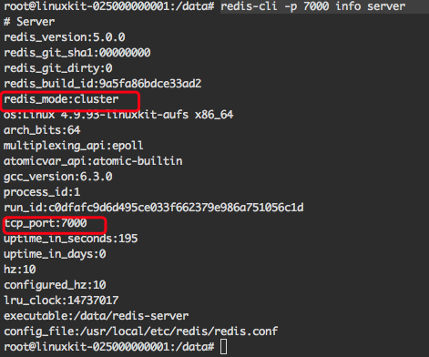
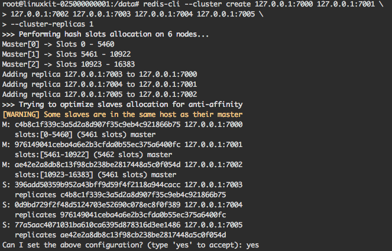

# 使用 docker redis-cluster 集群搭建
---
说明：由于 redis 集群目前不支持 NAT 环境，也不支持映射 IP 地址或 TCP 端口的一般环境，所以在使用 docker 启动 redis-cluster 时需要以 --net=host 的形式启动，或者使用`docker network create redis_cluster`创建一个 redis 网络，所有的实例都使用该网络。我们下面使用`host`网络。

## 创建六个文件夹，并在六个文件夹内编写 redis 启动配置文件
```sh
mkdir cluster-test
cd cluster-test
mkdir 7000 7001 7002 7003 7004 7005
```
每个文件夹下创建`redis.conf`,内容如下，需要将配置文件中的端口修改为各个文件夹名字对应的端口:
```conf
#redis-7000.conf 
port 7000 
cluster-enabled yes 
cluster-config-file nodes.conf
logfile log.log 
dbfilename dump.rdb
```

## 启动六个 redis-cluster 实例
```sh
docker run --name redis_7000 -v /Users/clx/dockerVolume/redis/cluster-test/7000/redis.conf:/usr/local/etc/redis/redis.conf --net=host -d redis:5 redis-server /usr/local/etc/redis/redis.conf
docker run --name redis_7001 -v /Users/clx/dockerVolume/redis/cluster-test/7001/redis.conf:/usr/local/etc/redis/redis.conf --net=host -d redis:5 redis-server /usr/local/etc/redis/redis.conf
docker run --name redis_7002 -v /Users/clx/dockerVolume/redis/cluster-test/7002/redis.conf:/usr/local/etc/redis/redis.conf --net=host -d redis:5 redis-server /usr/local/etc/redis/redis.conf
docker run --name redis_7003 -v /Users/clx/dockerVolume/redis/cluster-test/7003/redis.conf:/usr/local/etc/redis/redis.conf --net=host -d redis:5 redis-server /usr/local/etc/redis/redis.conf
docker run --name redis_7004 -v /Users/clx/dockerVolume/redis/cluster-test/7004/redis.conf:/usr/local/etc/redis/redis.conf --net=host -d redis:5 redis-server /usr/local/etc/redis/redis.conf
docker run --name redis_7005 -v /Users/clx/dockerVolume/redis/cluster-test/7005/redis.conf:/usr/local/etc/redis/redis.conf --net=host -d redis:5 redis-server /usr/local/etc/redis/redis.conf
```
运行节点后，进入 7000 节点，使用`redis-cli -p 7000 info server`查看节点信息，如下：

可以看到，节点的运行模式是`cluster`

## 创建集群
由于我们使用的是 redis:5，因此可以使用`redis-cli命令来直接直接启动集群,进入 7000 端口的 redis 镜像，执行下面的命令
```sh
redis-cli --cluster create 127.0.0.1:7000 127.0.0.1:7001 \
127.0.0.1:7002 127.0.0.1:7003 127.0.0.1:7004 127.0.0.1:7005 \
--cluster-replicas 1
```
由于我们的镜像都是以`host`的方式启动，redis-cluster 默认我们主从节点的 ip 一样，会提示我们主从节点的机器一样，然后 redis-cluster 会默认把节点的前三个设置为 master，后三个设置为 slave，并显示`插槽`分配结果并询问我们是否同意上面的设置:

我们输入`yes`，集群开始设计，并等待节点加入，不出问题集群会很快设置成功。


## 测试集群
进入 7000 容器，执行下面的命令
```sh
redis-cli -c -p 7000    # 进入 7000 端口的节点客户端，-c 表示开启 cluster 模式

127.0.0.1:7000> set foo bar
-> Redirected to slot [12182] located at 127.0.0.1:7002
OK
127.0.0.1:7002> set aa aa
-> Redirected to slot [1180] located at 127.0.0.1:7000
OK
127.0.0.1:7000> set bb bb
-> Redirected to slot [8620] located at 127.0.0.1:7001
OK
```
开启一个新的命令行
```sh
redis-cli -c -p 7001    # 进入 7001 端口的节点客户端

127.0.0.1:7000> get bb  
-> Redirected to slot [8620] located at 127.0.0.1:7001
"bb"
127.0.0.1:7001> get aa
-> Redirected to slot [1180] located at 127.0.0.1:7000
"aa"
127.0.0.1:7000> get foo
-> Redirected to slot [12182] located at 127.0.0.1:7002
"bar"

# get foo 刚开始可能会报 -> Redirected to slot [5061] located at 127.0.0.1:7000
# (nil)
# 因为 set foo 时最开始是同步到 7002， 同步到 7001 需要一段时间
```

## 小结
 - 在一个 master 上添加数据后，会首先将数据同步到其他 master 上，其他 master 然后将数据同步到各自的 node 节点上
 - redis-cli 进入客户端时，需要添加`-c`参数，表示启动`cluster`模式，否则进去后同步数据会出错。