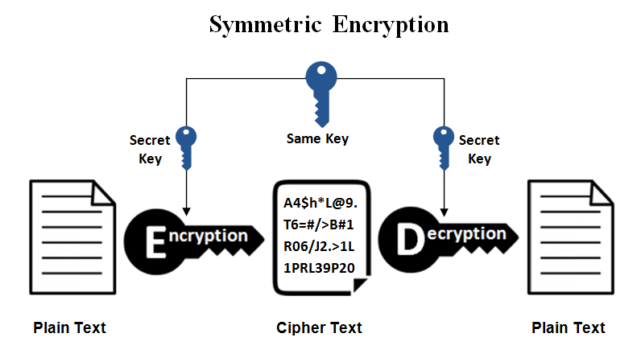

# hash and encrypt

## 什么是哈希

哈希是通过一个字符串或文本产生一个字符串或数字，产生的字符串或数字的结果长度是固定的，并且随着输入的微小变化结果会产生巨大的变化。好的哈希是使散列之后的结果无法转换回原字符串。

## 常用的哈希函 

* md5: md5 是一个使用非常广泛的哈希函数，产生一个 16 位的哈希值，通常表示为 32 位十六进制 
* sha: sha 是 secure hash algorithm(安全散列算法)的简称，有三种不同的 sha 算法：sha-0、sha-1、sha-2。sha-0很少使用，因为它包含一个用 sha-1 修复的错误。sha-1 是最常用的 sha 算法。它产生一个 20 字节的哈希值
* sha-2: sha-2 由一组 6 个哈希算法组成，被认为是最强的。建议在安全性至关重要的情况下使用 sha-256 或更高版本，sha-256 产生 32 字节的。

## 什么时候应该是用哈希

哈希是一种存储密码的理想方式，因为哈希本质上是单向的。利用哈希格式存储密码，有权访问原始数据的人很难将其解密，如果在哈希的时候使用适当的盐将更加难解密。

存储密码时，使用 salt 对其进行散列，然后在将来的任何登陆尝试中，对用户输入的密码进行散列。如果两者匹配，则几乎可以肯定输入密码的用户输入了正确的密码。

哈希非常适合在你想要将值与存储值进行表的任何实例中使用，但出于安全原因无法存储其原始值

## 什么是加密

1. 哈希不可逆，加密可逆

加密时将数据转换为一系列不可读的字符，这些字符的长度不固定。加密和哈希之间的主要区别在于，如果你有正确的密钥，加密的字符串可以反转回原始的字符串。

2. 哈希结果长度固定，加密结果长度不固定

哈希的结果是固定长度，而加密时将数据转换为一系列不可读的字符，这些字符的长度不固定

3. 哈希结果可读，加密结果不可读

哈希的结果通常是一个由字母和数字组合长的固定长度字符串，而加密的结果是一个不可读的字符，可能包含很多特殊字符。

4. 哈希只有一把钥匙，加解密有两把钥匙

 哈希的钥匙用于加密，没有解密钥匙；加密和解密通常由两把密钥组成，公钥通常用于加密字符串，私钥用于解密，公钥可以被任何人用于加密消息，而私钥只有解密者拥有。

## 流行的加密算法

* AES: AES时对称密钥加密的"黄金标准"，推荐用于大多数用例，密钥大小为 256 位
* PGP: PGP 是最流行的公钥加密算法

## 什么时候应该使用加密

1. 必须对信息进行解密时

当必须要对信息进行解密时，使用加密，而不是哈希。例如，如果你尝试像世界另一端的某人发送安全消息，则需要对消息进行加密而不是哈希，因为如果消息不能解密，则消息对接受者没有用。

2. 不需要知道原始值时应该始终使用哈希

如果不需要知道应用沉痼正常工作的原始值，则应该始终使用哈希，因为它更安全。

3. 对称加密与非对称加密

如果你确定需要加密的用例，需要对对称加密和非对称加密（公钥私钥形式）之间进行选择，对称加密性能更好，使用更简单，但是各方都需要知道密钥；非对称加密虽然性能没有对称加密性能好，但是安全性高。

4. 如果有已知的安全方式，则不推荐使用加密方式

如果你正在与世界另一端的某人进行通信，在共享你的安全邮件之前找到一种安全的方式向它们发送密钥；如果你已经有一种安全的方式像某人发送加密密钥，那么你应该通过该方式发动密钥，而不是首先使用对称加密去发送。

## 对称加密（symmetric）与非对称加密（asynmmetric algorithms）

开始讨论加密之前先介绍几个概念

### 算法

算法时用于解决数据窥探问题的过程和公式。加密算法适用于对数据执行加密的一组数学过程没通过这宗算法，信息在密文中产生，并且需要使用密钥将数据转换成其原始形式

### 密码学

密码学时一种使用高级数学原理以特定形式存储和传输的方法，使得只有某些人可以阅读和处理它。加密时密码学中的一个关键概念-这是一个消息以窃听者无法读取或理解的格式编码的过程。将来自用于的纯文本进行加密，然后通过通信信道进行发送，诶呦窃听者可以干扰纯文本，当信息到达接收方时，密为被解密为原始纯文本。

### 对称加密
下面是一张对称加密的原理图

对称加密时最简单的加密方式，只需要一个密钥来加密和解密信息。对称加密使用一个密钥，密钥可以时数字、单词或一串随机数字，以特定的方式将密钥与消息的纯文本进行混合，发件人和收件人都需要知道用于密钥。常用的对称加密算法有 Blowfish、AES、RC4、DES、RC5、RC6，使用最广泛的对称加密算法是 AES-128、AES-129 和 AES-256。

对称加密的优点是使用简单，加解密效率高；缺点是各方都需要知道密钥。

### 非对称加密
下面是一张对称加密的原理图

非对称加密也称为公钥加密，与对称加密相比更先进，安全性更高。非对称加密使用两个密钥来加密纯文本，密钥通过网络或线下进行交换，需要确保密钥的安全性，不能随意给别人。需要注意，任何拥有密钥的人读可以解密消息，者也是非对称加密使用两把密钥来提高安全的原因，任何可能希望向你发送消息的人都可以免费使用公钥，但是私钥只能你自己知道。

使用公钥加密的消息只能使用私钥解密，而使用私钥加密的消息也可可以使用公钥进行解密。公钥的安全性是非必须的，非对称加密在确保通信期间传输的信息的安全性上具有更好的能力。

非对称加密主要用于日常通信渠道，尤其是在互联网上，常用的非对称加密算法主要有 ElGamal、RSA、DSA、椭圆曲率技术、PKCS等。

### 非对称加密在数字证书中的应用

要使用非对称加密啊必须有一种方法去发现公钥，常用的方法是在客户端 - 服务器通信模型中使用数字证书。证书是标识用户和服务器的信息包，包含组织名称、办法证书的组织、用户电子邮件地址、国家/地区记忆用户公钥等信息。

当服务器和客户端需要安全的加密通信时，它们通过网络像另一方发送查询，另一方发回证书的副本，然后从证书中提取出另一方的公钥，证书也可以用于唯一标识持有者。SSL/TLS 同时使用非对称加密和对称加密。

证书包含公钥
