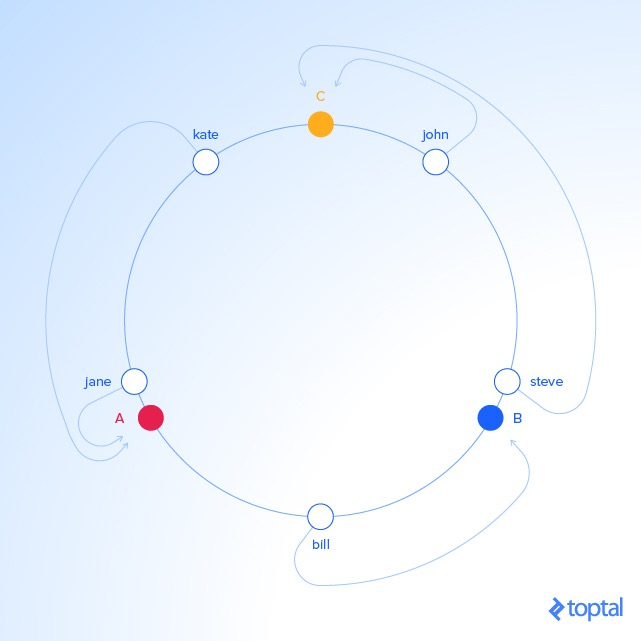
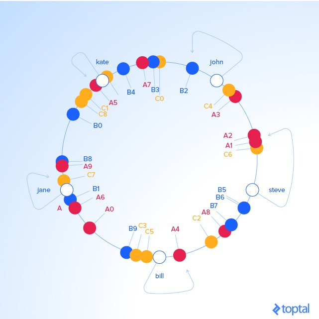
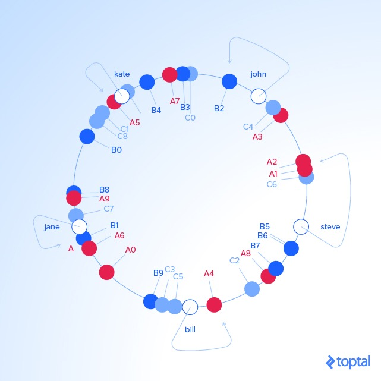
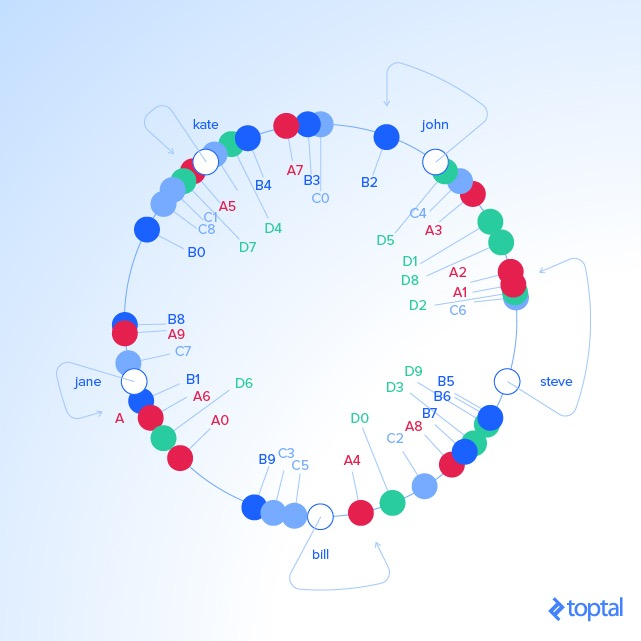

# 一致性哈希（consistent hashing）
---
原文地址: https://www.toptal.com/big-data/consistent-hashing

## 分布式哈希
在一些情况下，比如使用多机器内存，我们希望将哈希表拆分到不同的机器上，每个机器管理一部分。在这种情况下，键值分部在多个机器中，因此被称为分布式哈希。

常见的做法是对 key 进行哈希后取模，根据取模结果来决定数据存储到哪个机器上面。当时这样存在一个问题，就是当机器的数量发生改变时，原来的哈希结果会出现错误，因为取模的基数变了，这样会造成数据丢失或数据错误。**解决方法是使用一致性哈希。**

## 一致性哈希

### 相关知识
一致性哈希是一种分布式哈希方案，它通过在抽象圈或哈希环上为它们分配位置，独立于分布式哈希表中的服务器或对象的数量而运行，这允许服务器和对象扩展而不会影响整个系统。

想象一下，我们将哈希输出范围映射到圆的边缘，意味着最小可能的散列值将对应与零度角，最大可能值对应与 360 度角，其它哈希值将线性的介于最大值和最小值之间，因此我们通过计算一个 key 的哈希值，然后找出哈希值在圆边缘的位置。

同时，我们将服务器也放置在圆的边缘，通过伪随机分配它们的角度，通常是对机器 ip 使用哈希。

由于我们在同一个圆圈上有对象和服务器的 key，我们可以定义一个简单的规则来将前者和后者关联起来：每个对象的 key 通过顺时针或逆时针去关联离它最近的服务器；

我们将三个对象逆时针存储到离它们最近的一个服务器上面

### 增加或减少节点
当 B 节点丢失的情况下，A 到 B 之间的所有数据将全部迁移到 C，这样会造成 C 的压力非常大，数据分配不均匀，因此，为了保证数据的最大均匀性，我们对每个 server 虚拟出一定数量的节点，我们将 A、B、C 分别虚拟成 A0-A9、B0-B9、C0-C9，将他们分散在圆上，具体虚拟出几个节点根据实例情况来决定。现在我们给每个服务器的权重为 10，即每个节点虚拟成 10 个节点。

当 server C 被删除了，我们会删掉圆圈中删除标签 C0-C9，但是以前与已删除标签相邻的对象健现在随机分配给Ax和Bx，将它们重新分配给服务器 A 和 B。结果如下:

当 server D 添加进来的时候，我们需要添加标签 D1-D9，结果是大约有三分之一的现有 key 将被重新分配给 D

### 结论
当使用分布式缓存来优化性能时，可能会发生缓存服务器数量发生变化(当服务器崩溃、添加和减少节点时)；通过使用一致性哈希来在服务器之间分配 key，重新生成的 key 的数量以及因此对原始服务器的影响将被最小化，从而防止潜在的停机或性能问题。